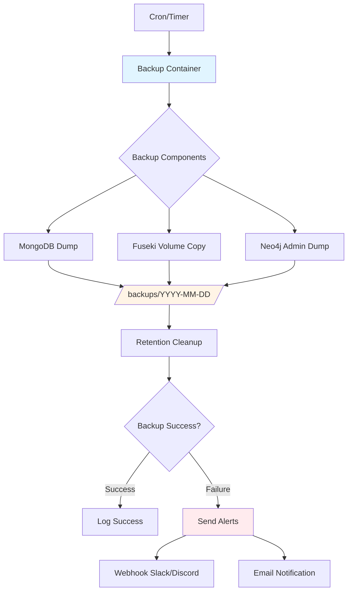
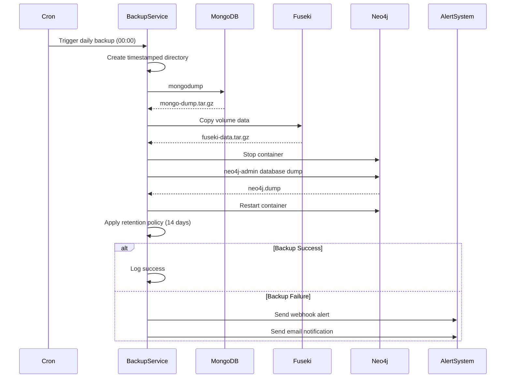

# Health Habit Hub - Complete Documentation

**Version:** 2.0
**Last Updated:** October 2025
**Production Domain:** https://habit.wiwi.tu-dresden.de
**Repository:** https://github.com/helict/health-habit-hub

---

## Table of Contents

1. [Project Overview](#project-overview)
2. [Quick Start](#quick-start)
3. [Architecture & Design](#architecture--design)
4. [Development Guide](#development-guide)
5. [Production Deployment](#production-deployment)
6. [Backup System](#backup-system)
7. [Testing](#testing)
8. [User Manual](#user-manual)
9. [Troubleshooting](#troubleshooting)
10. [API Reference](#api-reference)

---

## Project Overview

Health Habit Hub (H3) is a web-based platform for collecting, donating, and analyzing health habit data. The application is built with Node.js and uses a semantic RDF data model with multiple database backends for different purposes.

### Key Features

- **Habit Data Collection**: Survey-based habit data collection with SurveyJS
- **Data Donation**: Users can donate their habit data for research purposes
- **Graph Database**: Neo4j for storing donated habit relationships
- **Semantic Storage**: Apache Fuseki (RDF triple store) for semantic data
- **Multi-language Support**: English, German, and Japanese (i18n)
- **Translation API**: Integrated LibreTranslate for automatic translations
- **Automated Backups**: Daily automated backups with 14-day retention
- **Production-Ready**: Docker Compose with automatic SSL via Let's Encrypt

### Tech Stack

**Backend:**
- Node.js 22.x with Express.js
- EJS templating engine
- Multiple databases: MongoDB, Neo4j, Apache Fuseki (Jena)
- ReCAPTCHA integration for contact form
- Mailjet API for email notifications

**Frontend:**
- Vanilla JavaScript
- Bootstrap 5 for responsive design
- SurveyJS for dynamic forms
- Client-side routing with path-based navigation

**Infrastructure:**
- Docker & Docker Compose
- Traefik reverse proxy with Let's Encrypt SSL
- LibreTranslate API (self-hosted)
- Automated backup service

**Development Tools:**
- ESLint & Prettier for code quality
- Jest & Mocha for testing
- Docker Compose watch mode for hot-reload

### Repository Structure

```
health-habit-hub/
├── app/                          # Main Node.js application
│   ├── public/                   # Static assets (CSS, JS, images)
│   ├── views/                    # EJS templates
│   ├── routes/                   # Express routes
│   ├── utils/                    # Database utilities
│   ├── language/                 # i18n translations and legal content
│   ├── tests/                    # Test suites
│   └── server.js                 # Main server entry point
├── backup-service/               # Automated backup system
│   ├── backup.sh                 # Backup script
│   ├── restore.sh                # Restore script
│   └── Dockerfile                # Backup service image
├── fuseki/                       # Apache Jena Fuseki configuration
│   ├── Dockerfile                # Custom Fuseki image
│   └── config.ttl                # Fuseki dataset configuration
├── proxy/                        # Traefik reverse proxy
│   ├── traefik.yml               # Traefik static configuration
│   └── dynamic.yml               # Traefik dynamic routing
├── docs/                         # Documentation (deprecated - consolidated here)
├── docker-compose.yml            # Development environment
├── docker-compose.prod.yml       # Production environment
├── .env                          # Environment configuration
└── package.json                  # Node.js dependencies
```

### System Requirements

**Development:**
- Docker Engine 20.10+
- Docker Compose 2.0+
- Node.js 22.x (for local development)
- 4GB RAM minimum
- 10GB disk space

**Production:**
- Docker Engine 20.10+
- Docker Compose 2.0+
- 4GB RAM minimum (8GB recommended)
- 20GB disk space minimum
- Open ports: 80 (HTTP), 443 (HTTPS)

---

## Quick Start

### Local Development Setup

1. **Clone the repository**:
   ```bash
   git clone https://github.com/helict/health-habit-hub.git
   cd health-habit-hub
   ```

2. **Configure environment**:
   ```bash
   cp .env.example .env
   # Edit .env with your configuration
   ```

3. **Start the application**:
   ```bash
   docker-compose up -d --build
   ```

4. **Access the services**:
   - Main app: http://localhost
   - Traefik dashboard: http://localhost:8080
   - Fuseki: http://localhost/fuseki
   - Neo4j: http://localhost/neo4j
   - Translate: http://localhost/translate

5. **View logs**:
   ```bash
   docker-compose logs -f
   ```

6. **Stop the application**:
   ```bash
   docker-compose down
   # Remove volumes as well:
   docker-compose down -v
   ```

### Development with Hot Reload

Docker Compose watch mode enables automatic reloading:

```bash
docker-compose watch
```

This watches for file changes and automatically:
- Restarts the app container when Node.js files change
- Syncs static assets without restart

### Running Tests

```bash
# Run all tests
cd app
npm test

# Run specific test suites
npm test -- SparqlDatabase.test.js
npm test -- MongoDatabase.test.js
npm test -- Neo4jDatabase.test.js

# Run with integration tests enabled
ENABLE_INTEGRATION=1 npm test
```

---

## Architecture & Design

### Experimental Design

Health Habit Hub implements a **2×2 factorial experimental design** for habit data collection:

**Factors:**
1. **Donation Option** (2 levels):
   - Donation possible (users can donate habit data)
   - No donation option (data collection only)

2. **Visibility** (2 levels):
   - Public visibility (donated habits visible to others)
   - Private visibility (donated habits remain private)

**Experimental Groups:**

| Group | Donation | Visibility | Description |
|-------|----------|------------|-------------|
| 1     | Yes      | Public     | Full transparency - users can donate and see others' habits |
| 2     | Yes      | Private    | Anonymous donation - users can donate but cannot see others |
| 3     | No       | Public     | View-only - users see others' habits but cannot donate |
| 4     | No       | Private    | Control group - no donation, no visibility |

**Implementation:**

Users are randomly assigned to one of four groups upon accessing the application. The group assignment determines:
- Whether the "Donate Habit" button is visible
- Whether the "View Donated Habits" section is accessible
- What messaging is shown about data sharing

This design allows researchers to study:
- Effect of donation option on data collection
- Effect of visibility on user behavior
- Interaction effects between donation and visibility

### Data Model

#### RDF/SPARQL (Apache Fuseki)

Semantic data model using RDF triples:

```turtle
@prefix habit: <http://example.org/habit#> .
@prefix xsd: <http://www.w3.org/2001/XMLSchema#> .

habit:person_123 a habit:Person ;
    habit:hasHabit habit:habit_456 .

habit:habit_456 a habit:Habit ;
    habit:name "Morning Exercise"^^xsd:string ;
    habit:frequency "Daily"^^xsd:string ;
    habit:startDate "2025-01-01"^^xsd:date .
```

#### Neo4j Graph Database with n10s (Neosemantics)

The Neo4j database uses the **n10s (Neosemantics)** plugin to import RDF/OWL ontologies as property graphs. This bridges semantic web standards with graph database technology.

**What is n10s?**

n10s is a Neo4j plugin that:
- Imports RDF triples into Neo4j as nodes and relationships
- Maintains semantic ontology structure
- Enables SPARQL-like queries using Cypher
- Supports OWL ontologies and RDF vocabularies

**Configuration** (`Neo4jDatabase.js:170-211`):

```javascript
// Create required constraint for n10s
CREATE CONSTRAINT n10s_unique_uri IF NOT EXISTS
FOR (r:Resource) REQUIRE r.uri IS UNIQUE

// Initialize n10s configuration
CALL n10s.graphconfig.init({
  handleVocabUris: 'SHORTEN',  // Shorten URIs to prefixes
  keepLangTag: true,            // Keep language tags
  handleMultival: 'ARRAY'       // Store multiple values as arrays
})

// Register namespace prefix
CALL n10s.nsprefixes.add('hhh', 'http://example.com/hhh#')

// Import ontology from Turtle file
CALL n10s.rdf.import.fetch('file:///import/Ontology.ttl', 'Turtle')
```

**Graph Schema Structure:**

Every RDF entity becomes a Neo4j node with:
- Base label: `Resource` (required by n10s)
- Type-specific labels: `hhh__Habit`, `hhh__Behavior`, etc.
- Unique `uri` property for RDF identification

**Node Types (Classes):**

| Neo4j Label | RDF Class | Description |
|------------|-----------|-------------|
| `Resource` | Base class | All RDF entities (n10s requirement) |
| `hhh__Donor` | `hhh:Donor` | User who donated habit data |
| `hhh__Habit` | `hhh:Habit` | Health habit instance |
| `hhh__Behavior` | `hhh:Behavior` | Specific behavior within a habit |
| `hhh__Context` | `hhh:Context` | Base context class |
| `hhh__TimeReference` | `hhh:TimeReference` | Time context (e.g., "in the morning") |
| `hhh__PhysicalSetting` | `hhh:PhysicalSetting` | Location context (e.g., "at home") |
| `hhh__People` | `hhh:People` | Social context (e.g., "alone") |
| `hhh__InternalState` | `hhh:InternalState` | Emotional/physical state (e.g., "thirsty") |
| `hhh__PriorBehavior` | `hhh:PriorBehavior` | Preceding action (e.g., "after brushing teeth") |
| `hhh__Reasoning` | `hhh:Reasoning` | Motivation (e.g., "for hydration") |
| `hhh__Group1-4` | `hhh:Group1-4` | Experimental group assignments |

**Relationship Types:**

| Relationship | From | To | Description |
|-------------|------|-----|-------------|
| `hhh__donates` | Donor | Habit | Links donor to their habit |
| `hhh__hasBehavior` | Habit | Behavior | Habit contains specific behaviors |
| `hhh__hasContext` | Behavior | Context | Behavior has contextual factors |
| `hhh__partOf` | Behavior/Context | ExperimentalSetting | Part of experimental group |
| `hhh__hasTranslation` | Habit/Behavior | Habit/Behavior | Links original to translated version |

**Node Properties:**

Each node contains:
- `uri` - Unique RDF URI (required by n10s constraint)
- `hhh__id` - UUID identifier
- `hhh__value` - Text content (habit description, behavior text, etc.)
- `hhh__language` - Language code (en, de, ja)
- `hhh__source` - Origin (user ID or "translation")
- `hhh__habitStrength` - Numeric strength rating (for Habit nodes)
- `hhh__timestamp` - When donated (for Donor nodes)
- `hhh__userId` - User identifier (for Donor nodes)

**Example Data Flow:**

When you donate a habit like "I drink water after waking up", Neo4j creates:

```cypher
(:Resource:hhh__Donor {
  uri: "http://example.com/hhh#Donor-abc123",
  hhh__userId: ["user123"],
  hhh__timestamp: ["2025-10-15T10:00:00Z"]
})
  -[:hhh__donates]->
(:Resource:hhh__Habit {
  uri: "http://example.com/hhh#Habit-def456",
  hhh__id: ["def456"],
  hhh__value: ["I drink water after waking up"],
  hhh__habitStrength: [4],
  hhh__language: ["en"]
})
  -[:hhh__hasBehavior]->
(:Resource:hhh__Behavior {
  uri: "http://example.com/hhh#Behavior-ghi789",
  hhh__value: ["drink water"]
})
  -[:hhh__hasContext]->
(:Resource:hhh__TimeReference {
  uri: "http://example.com/hhh#Context-jkl012",
  hhh__value: ["in the morning"]
})
```

**Useful Cypher Queries:**

View habit donation structure:
```cypher
MATCH (d:hhh__Donor)-[:hhh__donates]->(h:hhh__Habit)-[:hhh__hasBehavior]->(b:hhh__Behavior)
OPTIONAL MATCH (b)-[:hhh__hasContext]->(c)
RETURN d, h, b, c
LIMIT 50
```

View only domain classes (hide base Resource):
```cypher
MATCH (n)
WHERE n:hhh__Habit OR n:hhh__Behavior OR n:hhh__Donor
RETURN n
LIMIT 100
```

Count nodes by type:
```cypher
MATCH (n)
RETURN labels(n) as type, count(*) as count
ORDER BY count DESC
```

Find habits with specific contexts:
```cypher
MATCH (h:hhh__Habit)-[:hhh__hasBehavior]->(b:hhh__Behavior)
      -[:hhh__hasContext]->(c:hhh__TimeReference)
WHERE any(v IN c.hhh__value WHERE v CONTAINS 'morning')
RETURN h.hhh__value as habit, c.hhh__value as context
```

**Understanding the Schema Visualization:**

When you run `CALL db.schema.visualization()` in Neo4j, you'll see:
- A large **`Resource`** node with many self-referencing arrows
  - This represents the base class for all RDF entities
  - Arrows show inheritance relationships from the ontology
- Additional labels like `hhh__Habit`, `hhh__Behavior` combined with `Resource`
- The n10s constraint: `n10s_unique_uri` ensures each Resource has a unique URI

This is normal behavior for n10s - it preserves the RDF/OWL ontology structure while mapping it to Neo4j's property graph model.

#### User Tracking: Linking MongoDB and Neo4j

Both MongoDB and Neo4j use the same **userId** (a UUID) to track user donations across systems, enabling complete traceability of which user submitted what habits.

**MongoDB Structure** (`surveyjs` database):
- **`results` collection**: Survey responses
  ```json
  {
    "_id": ObjectId("68f76b300b92c7be1f4f8801"),
    "userId": "7c9b24c7-7d25-43b6-8a7c-2e59f60d32dc",
    "surveyId": "1",
    "data": { /* survey responses */ },
    "submittedAt": ISODate("2024-10-21T10:30:00Z")
  }
  ```

**Neo4j Donor Node** (RDF/n10s):
```cypher
(:Resource:hhh__Donor {
  uri: "http://example.com/hhh#Donor-xyz",
  hhh__userId: ["7c9b24c7-7d25-43b6-8a7c-2e59f60d32dc"],  // Same UUID!
  hhh__timestamp: ["2024-10-21T10:30:00Z"],
  hhh__donates: "Habit-abc123"
})
```

**How to Find User Habits**:

1. **Get userId from MongoDB**:
   ```javascript
   db.results.findOne({ _id: ObjectId("68f76b300b92c7be1f4f8801") })
   // Extract: userId = "7c9b24c7-7d25-43b6-8a7c-2e59f60d32dc"
   ```

2. **Query Neo4j for all habits** (note: properties are arrays, use `IN` operator in Browser UI):
   ```cypher
   MATCH (habit:hhh__Habit)
   WHERE '7c9b24c7-7d25-43b6-8a7c-2e59f60d32dc' IN habit.hhh__source
   RETURN
     habit.hhh__value[0] as habitText,
     habit.hhh__language[0] as language,
     habit.hhh__habitStrength[0] as strength
   ```

3. **Get habit with translations**:
   ```cypher
   MATCH (original:hhh__Habit)
   WHERE '7c9b24c7-7d25-43b6-8a7c-2e59f60d32dc' IN original.hhh__source
   MATCH (original)-[trans:hhh__hasTranslation]->(translated:hhh__Habit)
   RETURN
     original.hhh__value[0] as originalText,
     original.hhh__language[0] as originalLanguage,
     translated.hhh__value[0] as translatedText,
     translated.hhh__language[0] as translatedLanguage
   ```

**Key Points**:
- The **userId** is a UUID stored as an HTTP-only cookie (365-day expiration)
- It persists across user sessions
- Same value appears in both MongoDB `results.userId` and Neo4j `Donor.hhh__userId`
- Every habit donation creates a Donor node linking the user to their habit
- All data is anonymized for research purposes

#### Neo4j Translation Storage Implementation

The application stores multilingual habits with full translation support. When a non-English habit is submitted, the system:
1. Stores the original habit in the submitted language
2. Translates all components (habit text, behaviors, contexts) via LibreTranslate API
3. Creates translation nodes linked bidirectionally in Neo4j with `hhh:hasTranslation` relationships

**Storage Format**:

All properties in Neo4j are stored as **arrays** (due to n10s RDF import). Labels use double underscores (`hhh__`). When querying, extract array elements using `[0]`:

```cypher
MATCH (habit:hhh__Habit)
WHERE '7c9b24c7-7d25-43b6-8a7c-2e59f60d32dc' IN habit.hhh__source
RETURN
  habit.hhh__value[0] as habitText,
  habit.hhh__language[0] as language,
  habit.hhh__habitStrength[0] as strength,
  habit.hhh__source[0] as donor
```

**Example: German Habit with English Translation**

User submits "Nachdem ich aufgestanden bin zu Hause, dehne ich mich kurz":

**German Nodes**:
- Habit: `hhh__value: ["Nachdem ich aufgestanden bin zu Hause, dehne ich mich kurz."]`, `hhh__language: ["de"]`, `hhh__source: ["7c9b24c7-7d25-43b6-8a7c-2e59f60d32dc"]`
- TimeReference Context: `hhh__value: ["Nachdem ich aufgestanden bin"]`, `hhh__language: ["de"]`
- PhysicalSetting Context: `hhh__value: ["zu Hause"]`, `hhh__language: ["de"]`
- Behavior: `hhh__value: ["dehne ich mich kurz"]`, `hhh__language: ["de"]`

**English Translation Nodes** (created automatically):
- Habit: `hhh__value: ["After waking up at home, I stretch briefly."]`, `hhh__language: ["en"]`, `hhh__source: ["translation"]`
- TimeReference Context: `hhh__value: ["After waking up"]`, `hhh__language: ["en"]`, `hhh__source: ["translation"]`
- PhysicalSetting Context: `hhh__value: ["at home"]`, `hhh__language: ["en"]`, `hhh__source: ["translation"]`
- Behavior: `hhh__value: ["I stretch briefly"]`, `hhh__language: ["en"]`, `hhh__source: ["translation"]`

**Translation Links** (bidirectional):
```
German Habit ←→ hasTranslation ←→ English Habit
German Context ←→ hasTranslation ←→ English Context
German Behavior ←→ hasTranslation ←→ English Behavior
```

**Code Location**: `/app/utils/Neo4jDatabase.js`, lines 346-408

**Query for All Habits by User**:
```cypher
MATCH (h:hhh__Habit)
WHERE 'USER_ID_HERE' IN h.hhh__source
  AND h.hhh__language[0] = 'de'  // Original German habits only
RETURN
  h.hhh__value[0] as habitText,
  h.hhh__language[0] as language,
  h.hhh__habitStrength[0] as strength,
  h.hhh__timestamp[0] as submittedAt
ORDER BY h.hhh__timestamp DESC
```

**Query for Original + Translation Pair**:
```cypher
MATCH (original:hhh__Habit)
WHERE 'USER_ID_HERE' IN original.hhh__source
MATCH (original)-[trans:hhh__hasTranslation]->(translated:hhh__Habit)
RETURN
  original.hhh__value[0] as originalText,
  original.hhh__language[0] as originalLanguage,
  translated.hhh__value[0] as translatedText,
  translated.hhh__language[0] as translatedLanguage
```

#### MongoDB Document Store

Used for survey responses and transactional data:

```json
{
  "_id": "...",
  "userId": "123",
  "surveyData": {
    "habit": "Morning Exercise",
    "frequency": "Daily",
    "startDate": "2025-01-01"
  },
  "timestamp": "2025-01-01T08:00:00Z"
}
```

### System Architecture

```
┌─────────────────────────────────────────────────────────────┐
│                     Internet (Port 80/443)                  │
└──────────────────────────┬──────────────────────────────────┘
                           │
                           ▼
┌─────────────────────────────────────────────────────────────┐
│              Traefik Reverse Proxy (h3-proxy)               │
│  - Automatic SSL (Let's Encrypt)                            │
│  - HTTP → HTTPS redirect                                    │
│  - Path-based routing                                       │
└──────────────────────────┬──────────────────────────────────┘
                           │
         ┌─────────────────┴─────────────────┐
         │    Docker Network: h3-proxy       │
         │                                    │
    ┌────┴────┐  ┌──────┐  ┌───────┐  ┌─────┴─────┐
    │         │  │      │  │       │  │           │
    ▼         ▼  ▼      ▼  ▼       ▼  ▼           ▼
┌───────┐ ┌────────┐ ┌──────┐ ┌───────┐ ┌──────────┐
│  App  │ │ Fuseki │ │ Mongo│ │ Neo4j │ │Translate │
│Node.js│ │  RDF   │ │  DB  │ │ Graph │ │   API    │
│ :3000 │ │ :3030  │ │:27017│ │:7474  │ │  :5000   │
└───────┘ └────────┘ └──────┘ └───────┘ └──────────┘
    ▲         ▲         ▲        ▲          ▲
    │         │         │        │          │
    └─────────┴─────────┴────────┴──────────┘
              │
              ▼
    ┌──────────────────┐
    │  Backup Service  │
    │  (Daily cron)    │
    └──────────────────┘
```

### Database Backend Selection

The application supports flexible database backends via the `GRAPH_BACKEND` environment variable:

**Apache Fuseki (default)**:
```bash
GRAPH_BACKEND=fuseki
```
- RDF/SPARQL semantic queries
- W3C standards compliant
- Full semantic reasoning

**Neo4j**:
```bash
GRAPH_BACKEND=neo4j
NEO4J_URI=bolt://neo4j:7687
NEO4J_USER=neo4j
NEO4J_PASSWORD=your-password
```
- Property graph model
- Cypher query language
- High-performance graph traversal

### Routing Architecture

**Path-based routing** on single domain (both development and production):

| Path | Service | Description |
|------|---------|-------------|
| `/` | h3-app | Main application |
| `/fuseki/*` | h3-fuseki | RDF database UI |
| `/neo4j/*` | h3-neo4j | Neo4j browser |
| `/translate/*` | h3-translate | Translation API |
| `/dashboard/*` | h3-proxy | Traefik dashboard |

**Development (localhost)**:
- No SSL (HTTP only)
- Direct port access available for debugging
- http://localhost → Main app
- http://localhost:8080 → Traefik dashboard

**Production (habit.wiwi.tu-dresden.de)**:
- Automatic SSL via Let's Encrypt
- All traffic via Traefik (ports 80/443 only)
- https://habit.wiwi.tu-dresden.de → Main app
- https://habit.wiwi.tu-dresden.de/dashboard/ → Traefik dashboard

### Security Architecture

**Container Security:**
- All containers run as non-root users:
  - App: `node` user (from official Node.js image)
  - Fuseki: `fuseki` user (UID 9008)
  - MongoDB: `mongodb` user (UID 999)
  - Neo4j: `neo4j` user (UID 7474)
  - LibreTranslate: `libretranslate` user (UID 1032)

**Network Security:**
- Internal Docker network (`h3-proxy`)
- No direct port exposure in production (except 80/443)
- Database ports only accessible within Docker network

**Authentication:**
- Traefik dashboard: HTTP Basic Auth
- Fuseki: Admin authentication
- Neo4j: Password-protected
- MongoDB: Authentication enabled
- ReCAPTCHA v2 for donation form (server-side verification)

**SSL/TLS:**
- Automatic Let's Encrypt certificates
- HTTP → HTTPS redirect
- TLS 1.2+ only
- Strong cipher suites

---

## Development Guide

### Prerequisites

**Required:**
- Docker Engine 20.10+
- Docker Compose 2.0+
- Git

**Optional (for local development without Docker):**
- Node.js 22.x
- npm 10.x

### Initial Setup

1. **Clone and configure**:
   ```bash
   git clone https://github.com/helict/health-habit-hub.git
   cd health-habit-hub
   cp .env.example .env
   ```

2. **Edit `.env`** with your configuration:
   ```bash
   # Development uses simple passwords
   ADMIN_PASSWORD=admin
   MONGO_PASSWORD=admin
   NEO4J_PASSWORD=neo4j_password_change_me

   # ReCAPTCHA test keys (work on localhost only)
   RECAPTCHA_SITEKEY=6LeIxAcTAAAAAJcZVRqyHh71UMIEGNQ_MXjiZKhI
   RECAPTCHA_SECRETKEY=6LeIxAcTAAAAAGG-vFI1TnRWxMZNFuojJ4WifJWe

   # Graph backend selection
   GRAPH_BACKEND=neo4j  # or 'fuseki'
   ```

3. **Start development environment**:
   ```bash
   docker-compose up -d --build
   ```

### Development Workflow

**Watch mode for hot-reload**:
```bash
docker-compose watch
```

Changes to these files trigger automatic reload:
- `app/**/*.js` - Server restart
- `app/public/**/*` - File sync (no restart)
- `app/views/**/*.ejs` - File sync (no restart)

**View logs**:
```bash
# All services
docker-compose logs -f

# Specific service
docker-compose logs -f app
docker-compose logs -f neo4j
```

**Access services**:
- Main app: http://localhost
- Traefik dashboard: http://localhost:8080
- Fuseki UI: http://localhost/fuseki
- Neo4j browser: 
````
ssh -L 7475:localhost:7474 service@habitvm;
````

http://localhost:7474/browser/
- then connect via neo4j://localhost:7687
- Translation API: http://localhost/translate

**Execute commands in containers**:
```bash
# App container shell
docker exec -it h3-app sh

# Neo4j Cypher shell
docker exec -it h3-neo4j cypher-shell -u neo4j -p neo4j_password_change_me

# MongoDB shell
docker exec -it h3-mongo mongosh -u admin -p admin
```

### Code Quality

**Linting**:
```bash
cd app
npm run lint        # Check for issues
npm run lint:fix    # Auto-fix issues
```

**Formatting**:
```bash
npm run format      # Format with Prettier
```

**Testing**:
```bash
npm test                           # Run all tests
npm test -- SparqlDatabase.test.js # Run specific test
ENABLE_INTEGRATION=1 npm test      # Include integration tests
```

### Adding New Features

**1. Add a new route**:

Create `app/routes/myfeature.js`:
```javascript
const express = require('express');
const router = express.Router();

router.get('/myfeature', (req, res) => {
  res.render('myfeature', {
    title: 'My Feature',
    basePath: process.env.APP_BASE_PATH || '/'
  });
});

module.exports = router;
```

Register in `app/server.js`:
```javascript
const myfeatureRouter = require('./routes/myfeature');
app.use(basePath, myfeatureRouter);
```

**2. Add a new view**:

Create `app/views/myfeature.ejs`:
```html
<!DOCTYPE html>
<html>
<%- include('partials/header', {title: 'My Feature'}) %>
<body>
  <%- include('partials/navbar') %>

  <div class="container mt-4">
    <h1>My Feature</h1>
    <!-- Your content here -->
  </div>

  <%- include('partials/footer') %>
</body>
</html>
```

**3. Add database access**:

```javascript
const SparqlDatabase = require('./utils/SparqlDatabase');
const db = new SparqlDatabase();

// Query RDF data
const query = `
  PREFIX habit: <http://example.org/habit#>
  SELECT ?habit ?name WHERE {
    ?habit a habit:Habit ;
           habit:name ?name .
  }
`;
const results = await db.query(query);
```

**4. Add translations**:

Edit `app/language/en/translation.json`:
```json
{
  "myfeature": {
    "title": "My Feature",
    "description": "This is my new feature"
  }
}
```

Use in EJS:
```html
<h1><%= __('myfeature.title') %></h1>
<p><%= __('myfeature.description') %></p>
```

### Database Utilities

**SparqlDatabase (app/utils/SparqlDatabase.js)**:
```javascript
const db = new SparqlDatabase({
  endpoint: 'http://fuseki:3030/hhh',
  user: 'admin',
  password: process.env.ADMIN_PASSWORD
});

// Execute SPARQL query
const results = await db.query('SELECT * WHERE { ?s ?p ?o } LIMIT 10');

// Execute SPARQL update
await db.update(`
  PREFIX habit: <http://example.org/habit#>
  INSERT DATA {
    habit:habit_123 a habit:Habit ;
                     habit:name "New Habit" .
  }
`);
```

**Neo4jDatabase (app/utils/Neo4jDatabase.js)**:
```javascript
const db = new Neo4jDatabase({
  uri: process.env.NEO4J_URI,
  user: process.env.NEO4J_USER,
  password: process.env.NEO4J_PASSWORD
});

// Execute Cypher query
const result = await db.query(
  'MATCH (h:Habit) RETURN h.name AS name LIMIT 10'
);

// Create nodes
await db.query(
  'CREATE (h:Habit {name: $name, frequency: $frequency})',
  { name: 'New Habit', frequency: 'Daily' }
);
```

**MongoDatabase (app/utils/MongoDatabase.js)**:
```javascript
const db = new MongoDatabase({
  host: process.env.MONGO_HOST,
  port: process.env.MONGO_PORT,
  database: process.env.MONGO_DB,
  user: process.env.MONGO_USER,
  password: process.env.MONGO_PASSWORD
});

await db.connect();

// Insert document
await db.collection('surveys').insertOne({
  userId: '123',
  data: { habit: 'Exercise', frequency: 'Daily' }
});

// Find documents
const surveys = await db.collection('surveys').find({ userId: '123' }).toArray();

await db.close();
```

### i18n Internationalization

**Supported languages**:
- English (en)
- German (de)
- Japanese (ja)

**Language detection**:
1. User preference (if logged in)
2. `lang` query parameter (`?lang=de`)
3. Browser Accept-Language header
4. Default: English

**Translation files**:
- `app/language/en/translation.json`
- `app/language/de/translation.json`
- `app/language/ja/translation.json`

**Usage in code**:
```javascript
// Server-side (Express)
res.render('page', {
  title: req.__('page.title'),
  description: req.__('page.description')
});

// Client-side (EJS)
<h1><%= __('page.title') %></h1>
```

**Adding new translations**:
1. Add key to all language files
2. Restart app container
3. Test in all languages

### Environment Variables

**Complete .env reference**:

```bash
# Proxy Configuration
PROXY_PATH=proxy
PATH_SUFFIX=localhost
TRAEFIK_HOST_PORT80=80
TRAEFIK_HOST_PORT8080=8080

# Application
APP_PATH=app
APP_BASE_PATH=/app/
APP_HOST_PORT=1000

# Fuseki RDF Database
FUSEKI_PATH=fuseki
FUSEKI_HOST_PORT=3030

# Translation API
TRANSLATE_HOST=translate
TRANSLATE_PORT=5000
LT_HOST=${TRANSLATE_HOST}
LT_PORT=${TRANSLATE_PORT}
LT_LOAD_ONLY=de,en,ja
LT_REQ_LIMIT=0

# Database Authentication
ADMIN_PASSWORD=admin
HOST=localhost
DB_HOST=fuseki
DB_PORT=3030
DB_USER=admin
DB_PASSWORD=admin
DB_PATH=hhh

# Graph Backend Selection
GRAPH_BACKEND=neo4j  # 'fuseki' or 'neo4j'

# Neo4j Configuration
NEO4J_URI=bolt://neo4j:7687
NEO4J_USER=neo4j
NEO4J_PASSWORD=neo4j_password_change_me

# ReCAPTCHA (use production keys in production!)
RECAPTCHA_SITEKEY=6LeIxAcTAAAAAJcZVRqyHh71UMIEGNQ_MXjiZKhI
RECAPTCHA_SECRETKEY=6LeIxAcTAAAAAGG-vFI1TnRWxMZNFuojJ4WifJWe
RECAPTCHA_USE_RECAPTCHA_DOMAIN=true

# MongoDB Configuration
MONGO_HOST=localhost
MONGO_PORT=27017
MONGO_USER=admin
MONGO_PASSWORD=admin
MONGO_DB=test_surveyjs
MONGO_AUTH_SOURCE=admin
MONGO_SERVER_SELECTION_TIMEOUT_MS=5000
MONGO_SOCKET_TIMEOUT_MS=5000

# Mail Setup (Mailjet)
MAIL_USER=your-mailjet-api-key
MAIL_PASS=your-mailjet-secret-key
MAIL_FROM=noreply@felixreinsch.de
MAIL_RECEIVER=felix.reinsch@tu-dresden.de

# Backup Configuration
BACKUP_RETENTION_DAYS=14
ALERT_WEBHOOK_URL=  # Optional: Slack/Discord webhook
ALERT_EMAIL=        # Optional: Email for alerts
```

---

## Production Deployment

### Overview

This guide covers deploying Health Habit Hub to production using Portainer on your server.

**Server Details:**
- **IP**: 141.76.16.16
- **Domain**: habit.wiwi.tu-dresden.de
- **Management**: Portainer
- **Auto-update**: Every 5 minutes from `master` branch

### Pre-Deployment Checklist

#### 1. Server Prerequisites

- [ ] Server accessible at 141.76.16.16
- [ ] Portainer installed and running
- [ ] Ports 80 and 443 open in firewall
- [ ] Docker installed (managed by Portainer)

#### 2. DNS Configuration

- [x] Domain `habit.wiwi.tu-dresden.de` resolves to `141.76.16.16`
- [x] DNS propagation complete (verified with `dig`)

Ensure DNS A record is configured:
```
habit.wiwi.tu-dresden.de → 141.76.16.16
```

Verify DNS propagation:
```bash
dig habit.wiwi.tu-dresden.de
nslookup habit.wiwi.tu-dresden.de
```

#### 3. External Services

- [ ] Google reCAPTCHA keys obtained (https://www.google.com/recaptcha/admin)
  - Site key
  - Secret key
  - Domain `habit.wiwi.tu-dresden.de` added
- [ ] Mailjet API credentials obtained (https://app.mailjet.com/account/api_keys)
  - API key
  - Secret key
  - Sender domain verified

#### 4. Firewall Configuration

**Required open ports on server (141.76.16.16)**:
- **Port 80** (HTTP) - Required for Let's Encrypt HTTP-01 challenge
- **Port 443** (HTTPS) - For secure HTTPS traffic
- **Port 9000** (Optional) - Portainer UI

**Check if ports are open**:
```bash
# Check port status
sudo netstat -tlnp | grep :80
sudo netstat -tlnp | grep :443
sudo ss -tlnp | grep :80
sudo ss -tlnp | grep :443
```

**Open ports with UFW (Ubuntu/Debian)**:
```bash
sudo ufw allow 80/tcp
sudo ufw allow 443/tcp
sudo ufw status
```

**Open ports with firewalld (RHEL/CentOS)**:
```bash
sudo firewall-cmd --permanent --add-port=80/tcp
sudo firewall-cmd --permanent --add-port=443/tcp
sudo firewall-cmd --reload
sudo firewall-cmd --list-ports
```

**Open ports with iptables**:
```bash
sudo iptables -A INPUT -p tcp --dport 80 -j ACCEPT
sudo iptables -A INPUT -p tcp --dport 443 -j ACCEPT
sudo iptables-save
```

**Test port accessibility from outside**:
```bash
# From your local machine
telnet 141.76.16.16 80
curl -I http://141.76.16.16
nc -zv 141.76.16.16 80
nc -zv 141.76.16.16 443
```

#### 5. Server Requirements

- Docker Engine 20.10+
- Docker Compose 2.0+
- Portainer CE/BE installed
- At least 4GB RAM (8GB recommended)
- At least 20GB disk space

**Verify Docker**:
```bash
docker ps
docker --version
docker compose version
```

#### 6. Check Nothing is Using Ports 80/443

```bash
# Check what's listening
sudo lsof -i :80
sudo lsof -i :443
```

**If ports are in use, stop conflicting services**:
```bash
# Stop Apache
sudo systemctl stop apache2

# Stop Nginx
sudo systemctl stop nginx
```

#### 7. Security

- [ ] Generate secure passwords for:
  - Fuseki admin password
  - MongoDB password
  - Mongo Express password
  - Neo4j password
  - Traefik dashboard password (use `htpasswd -nb admin your-password`)

### Portainer Deployment Steps

#### Step 1: Access Portainer

1. Navigate to Portainer web interface at `http://141.76.16.16:9000`
2. Login with your credentials
3. Select your environment

#### Step 2: Create Stack

1. Go to **Stacks** → **Add stack**
2. Stack name: `health-habit-hub`
3. Build method: **Repository**

#### Step 3: Configure Git Repository

- **Repository URL:** `https://github.com/helict/health-habit-hub`
- **Repository reference:** `refs/heads/master`
- **Compose path:** `docker-compose.prod.yml`
- **GitOps updates:** Enable
  - Polling interval: 5 minutes
  - Re-pull image: Enable
  - Force redeployment: Enable

#### Step 4: Override Environment Variables

The `stack.env` file contains template values. Override these in Portainer:

**Required Overrides:**
```env
# Passwords (generate secure ones!)
ADMIN_PASSWORD=<your-secure-fuseki-password>
MONGO_PASSWORD=<your-secure-mongo-password>
MONGO_EXPRESS_PASSWORD=<your-secure-mongo-express-password>
NEO4J_PASSWORD=<your-secure-neo4j-password>

# Traefik Dashboard (generate: htpasswd -nb admin your-password)
TRAEFIK_DASHBOARD_AUTH=<your-htpasswd-hash>

# reCAPTCHA (from Google)
RECAPTCHA_SITEKEY=<your-production-site-key>
RECAPTCHA_SECRETKEY=<your-production-secret-key>

# Mailjet (from Mailjet dashboard)
MAIL_USER=<mailjet-api-key>
MAIL_PASS=<mailjet-secret-key>
```

**Optional Overrides:**
```env
# Backup alerts (Slack/Discord/Teams webhook)
ALERT_WEBHOOK_URL=<your-webhook-url>

# Backup retention
BACKUP_RETENTION_DAYS=14
```

#### Step 5: Deploy

1. Click **Deploy the stack**
2. Wait for deployment (5-10 minutes for initial setup)
3. Monitor container logs for any errors

### Post-Deployment Verification

#### 1. Check Container Status

All containers should be running:
- `h3-proxy` (Traefik)
- `h3-app` (Node.js application)
- `h3-fuseki` (RDF database)
- `h3-mongo` (MongoDB)
- `h3-mongo-express` (MongoDB web UI)
- `h3-neo4j` (Graph database)
- `h3-translate` (LibreTranslate)
- `h3-backup` (Backup service)

#### 2. Verify SSL Certificate

- Check Traefik logs: Look for "certificate obtained"
- Visit https://habit.wiwi.tu-dresden.de
- Verify valid SSL certificate (green padlock)

#### 3. Test Services

- [ ] Main application: https://habit.wiwi.tu-dresden.de
- [ ] Mongo Express: https://habit.wiwi.tu-dresden.de/mongo
- [ ] Fuseki (requires auth): https://habit.wiwi.tu-dresden.de/fuseki
- [ ] Translation API: https://habit.wiwi.tu-dresden.de/translate
- [ ] Neo4j browser: http://localhost:7474 (via SSH tunnel)
- [ ] Traefik dashboard: https://habit.wiwi.tu-dresden.de/dashboard

#### 4. Test Backup System

Check backup logs:
```bash
docker logs h3-backup
```

Verify backup files are created:
- Location: `/backups` directory
- Format: `full_backup_YYYYMMDD_HHMMSS.tar.gz`

### Network Architecture

#### How It Works

1. **External Traffic:**
   - Internet → Port 80/443 → Traefik (h3-proxy)

2. **Internal Routing:**
   - Traefik inspects Host/Path
   - Routes to appropriate service via `h3-proxy` network

3. **Service Communication:**
   - All services on `h3-proxy` bridge network
   - Services use container names (mongo, fuseki, neo4j)
   - No direct internet exposure

#### Network Diagram

```
Internet
   ↓
Port 80/443
   ↓
Traefik (h3-proxy)
   ↓
h3-proxy network (bridge)
   ├── h3-app (Node.js)
   ├── h3-fuseki (RDF)
   ├── h3-mongo (MongoDB)
   ├── h3-mongo-express (MongoDB UI)
   ├── h3-neo4j (Graph) - Port 7474/7687 exposed for SSH tunnel
   ├── h3-translate (LibreTranslate)
   └── h3-backup (Backup service)
```

### Automatic Updates

#### How It Works

- Portainer checks `master` branch every 5 minutes
- If changes detected:
  1. Pulls latest code
  2. Rebuilds images if needed
  3. Recreates containers
  4. Zero-downtime for config changes

#### Triggering Manual Update

In Portainer:
1. Go to **Stacks** → `health-habit-hub`
2. Click **Pull and redeploy**

### Troubleshooting

#### SSL Certificate Issues

**Problem:** Certificate not obtained

**Solutions:**
1. Check ports 80/443 are open:
   ```bash
   sudo ufw status
   ```
2. Verify DNS propagation:
   ```bash
   dig habit.wiwi.tu-dresden.de
   ```
3. Check Traefik logs:
   ```bash
   docker logs h3-proxy | grep -i certificate
   ```

#### Services Can't Communicate

**Problem:** App can't connect to MongoDB/Fuseki/Neo4j

**Solutions:**
1. Verify all containers on same network:
   ```bash
   docker network inspect h3-proxy
   ```
2. Check service names match docker-compose.prod.yml
3. Verify environment variables in Portainer

#### Backup Failures

**Problem:** Backup container shows errors

**Solutions:**
1. Check backup logs:
   ```bash
   docker logs h3-backup
   ```
2. Verify MongoDB credentials match
3. Ensure `/backups` directory has write permissions
4. Check disk space

#### Container Won't Start

**Problem:** Container in restart loop

**Solutions:**
1. Check container logs:
   ```bash
   docker logs <container-name>
   ```
2. Verify environment variables set correctly
3. Check resource constraints (memory/CPU)

### Monitoring

#### Container Logs

View logs in Portainer:
- **Stacks** → `health-habit-hub` → Click container → **Logs**

Or via CLI:
```bash
docker logs -f <container-name>
```

#### Resource Usage

View in Portainer:
- **Containers** → Click container → **Stats**

#### Backup Status

Check latest backup:
```bash
docker exec h3-backup ls -lh /backups/full_backup_*.tar.gz | tail -5
```

View backup manifest:
```bash
docker exec h3-backup cat /backups/backup_*.manifest | tail -20
```

### Maintenance

#### Updating Application Code

1. Push changes to `master` branch
2. Wait 5 minutes (or trigger manual update)
3. Verify deployment in Portainer logs

#### Rotating Passwords

1. Generate new secure password
2. Update in Portainer environment variables
3. Click **Update the stack**
4. Restart affected containers

#### Backup Restoration

See `backup-service/restore.sh` for restoration procedures.

#### Certificate Renewal

Automatic via Let's Encrypt:
- Certificates auto-renew 30 days before expiry
- Monitor Traefik logs for renewal notices

### Security Best Practices

- [ ] All passwords are strong and unique
- [ ] Traefik dashboard protected with authentication
- [ ] Regular backups verified
- [ ] Security updates applied to base images
- [ ] Logs monitored for suspicious activity
- [ ] Firewall configured (only ports 80/443 open)
- [ ] SSH key authentication enabled
- [ ] Root login disabled

### Support

#### Logs Location

- Traefik: `docker logs h3-proxy`
- Application: `docker logs h3-app`
- Backups: `docker logs h3-backup`
- All others: `docker logs <container-name>`

#### Health Checks

```bash
# Check all containers
docker ps

# Check network
docker network inspect h3-proxy

# Check volumes
docker volume ls | grep h3-
```

### URLs Reference

| Service | URL | Authentication |
|---------|-----|----------------|
| Main App | https://habit.wiwi.tu-dresden.de | None |
| Mongo Express | https://habit.wiwi.tu-dresden.de/mongo | Basic Auth (admin) |
| Fuseki | https://habit.wiwi.tu-dresden.de/fuseki | Basic Auth (admin) |
| Translation | https://habit.wiwi.tu-dresden.de/translate | None |
| Neo4j Browser | via SSH tunnel (see below) | Neo4j Auth |
| Traefik Dashboard | https://habit.wiwi.tu-dresden.de/dashboard | Basic Auth |

### Accessing Neo4j Browser via SSH Tunnel

Neo4j Browser requires an SSH tunnel for secure access. The database runs internally on the server but only exposes its ports through the tunnel for security.

#### What is SSH Tunneling?

SSH tunneling (port forwarding) creates a secure encrypted connection that forwards traffic from your local machine to the remote server. This allows you to access Neo4j's web browser and Bolt protocol securely without exposing the ports directly to the internet.

#### Connection Methods

You can connect to the server using either the domain name or IP address:

##### Option 1: Using Domain Name (Recommended)

```bash
# Create SSH tunnel (keeps connection open)
ssh -L 7474:localhost:7474 -L 7687:localhost:7687 service@habit.wiwi.tu-dresden.de
```

##### Option 2: Using IP Address

```bash
# Create SSH tunnel using direct IP address
ssh -L 7474:localhost:7474 -L 7687:localhost:7687 service@141.76.16.16
```

**Note:** The IP address `141.76.16.16` is useful when DNS is not available or for direct server access.

#### How to Access Neo4j Browser

1. **Start the SSH tunnel** in a terminal window (keep it open):
   ```bash
   # Use one of the commands above
   ssh -L 7474:localhost:7474 -L 7687:localhost:7687 service@habit.wiwi.tu-dresden.de
   ```

2. **Open Neo4j Browser** in your web browser:
   - Navigate to: `http://localhost:7474`

3. **Authenticate** with Neo4j credentials:
   - **Username:** `neo4j`
   - **Password:** Use the password from `NEO4J_PASSWORD` environment variable in Portainer
   - **Connection URL:** `neo4j://localhost:7687` (will auto-populate)

4. **Keep the SSH tunnel open** while using Neo4j Browser. The tunnel forwards traffic as follows:
   - Port 7474 (HTTP Browser): `localhost:7474` → `server:7474`
   - Port 7687 (Bolt Protocol): `localhost:7687` → `server:7687`

#### SSH Tunnel Explanation

The SSH command maps two ports:
- **7474**: Neo4j HTTP browser interface
- **7687**: Neo4j Bolt protocol (database connection)

Breakdown of the command:
```bash
ssh -L 7474:localhost:7474 -L 7687:localhost:7687 service@141.76.16.16
      ↓                         ↓                        ↓
   Local→Remote            Local→Remote            Connection
   mapping                  mapping                 credentials
```

#### Advanced: Connecting via Cypher Shell

If you need direct command-line access to Neo4j while the SSH tunnel is active:

```bash
# In another terminal (after SSH tunnel is open):
docker exec -it h3-neo4j cypher-shell -u neo4j -p ${NEO4J_PASSWORD} -a bolt://localhost:7687
```

Or directly through the SSH tunnel on the server:
```bash
# From your local machine
ssh service@141.76.16.16 'docker exec -it h3-neo4j cypher-shell -u neo4j -p ${NEO4J_PASSWORD}'
```

#### Troubleshooting SSH Tunnel Connection

**Issue: "Connection refused" on localhost:7474**
- Ensure the SSH tunnel is still active in your terminal
- Verify Neo4j container is running: `docker ps | grep neo4j`
- Check if another service is using port 7474 locally: `lsof -i :7474`

**Issue: SSH connection fails**
- Verify SSH key authentication is configured
- Check server IP/domain is correct and accessible
- Ensure firewall allows SSH connections (usually port 22)
- Test connection first: `ssh -v service@141.76.16.16` (shows debug info)

**Issue: Neo4j authentication fails**
- Verify the NEO4J_PASSWORD in Portainer matches what you're using
- Make sure credentials are for the "neo4j" user, not another user
- Check Neo4j container logs: `docker logs h3-neo4j | tail -20`

**Issue: Slow or dropped connections**
- SSH tunnels can timeout after inactivity
- Add keepalive option: `ssh -o ServerAliveInterval=60 -L 7474:localhost:7474 -L 7687:localhost:7687 service@141.76.16.16`
- Consider using screen/tmux to keep tunnel persistent

### Data Access and Management

#### MongoDB Data

**Location on Server:**
- Database files: `/mnt/data/appdata/hhh/mongo/db`
- Config files: `/mnt/data/appdata/hhh/mongo/config`

**Access via Mongo Express (Web UI):**
- URL: https://habit.wiwi.tu-dresden.de/mongo
- Username: `admin` (from MONGO_EXPRESS_USER)
- Password: (from MONGO_EXPRESS_PASSWORD in .env)

**Initialization:**
MongoDB is automatically initialized on first run with:
- Database: `surveyjs`
- Collections: `surveys` (with sample survey), `results` (with sample responses)
- Initialization script: `mongo/entrypoint/surveyjs-init.js`

**Backup MongoDB:**
```bash
# Create backup
docker exec h3-mongo mongodump --username admin --password ${MONGO_PASSWORD} --authenticationDatabase admin --out /tmp/backup

# Copy backup to host
docker cp h3-mongo:/tmp/backup ./mongo-backup-$(date +%Y%m%d)
```

**Restore MongoDB:**
```bash
# Copy backup to container
docker cp ./mongo-backup-YYYYMMDD h3-mongo:/tmp/restore

# Restore
docker exec h3-mongo mongorestore --username admin --password ${MONGO_PASSWORD} --authenticationDatabase admin /tmp/restore
```

**Direct Access via CLI:**
```bash
# Connect to MongoDB shell
docker exec -it h3-mongo mongosh -u admin -p ${MONGO_PASSWORD} --authenticationDatabase admin

# List databases
show dbs

# Use surveyjs database
use surveyjs

# Show collections
show collections

# Query surveys
db.surveys.find()

# Query results
db.results.find()
```

#### Neo4j Data

**Location on Server:**
- Database files: `/mnt/data/appdata/hhh/neo4j/data`
- Log files: `/mnt/data/appdata/hhh/neo4j/logs`

**Access via Browser:**
See "Accessing Neo4j Browser via SSH Tunnel" above.

**Backup Neo4j:**
```bash
# Stop Neo4j container first
docker stop h3-neo4j

# Create backup
sudo tar -czf neo4j-backup-$(date +%Y%m%d).tar.gz /mnt/data/appdata/hhh/neo4j/data

# Restart Neo4j
docker start h3-neo4j
```

**Restore Neo4j:**
```bash
# Stop Neo4j container
docker stop h3-neo4j

# Restore backup
sudo tar -xzf neo4j-backup-YYYYMMDD.tar.gz -C /

# Restart Neo4j
docker start h3-neo4j
```

**Direct Access via Cypher Shell:**
```bash
# Connect to Neo4j Cypher shell
docker exec -it h3-neo4j cypher-shell -u neo4j -p ${NEO4J_PASSWORD}

# Example queries
MATCH (n) RETURN count(n);  # Count all nodes
MATCH (n) RETURN n LIMIT 10;  # Show first 10 nodes
```

#### Fuseki Data

**Location on Server:**
- RDF data: Named volume `h3-fuseki-data`

**Backup Fuseki:**
```bash
# Backup is included in automated daily backups
# Manual backup:
docker run --rm -v h3-fuseki-data:/data -v $(pwd):/backup alpine tar czf /backup/fuseki-backup-$(date +%Y%m%d).tar.gz -C /data .
```

**Restore Fuseki:**
```bash
# Restore from backup
docker run --rm -v h3-fuseki-data:/data -v $(pwd):/backup alpine tar xzf /backup/fuseki-backup-YYYYMMDD.tar.gz -C /data
```

### Additional Notes

- Backups run daily at midnight
- Backup retention: 14 days (configurable)
- All data persisted in named Docker volumes or host-mounted directories
- SSL certificates stored in `/mnt/data/appdata/hhh/traefik-certs/`
- MongoDB automatically initializes with sample survey data on first run
- Neo4j requires SSH tunnel for secure browser access

---

## Backup System

### Overview

Health Habit Hub includes an automated backup system that runs daily and backs up all critical data:

- **MongoDB** (survey data)
- **Apache Fuseki** (RDF triple store)
- **Neo4j** (graph database)

**Key Features:**
- Automated daily backups via Docker container
- 14-day retention policy (configurable)
- Neo4j native dumps using temporary volumes for consistency
- Unified backup archives with manifests
- Webhook alerts (Slack/Discord/Teams)
- Email notifications via Mailjet API
- Per-component error tracking
- Docker-based restore capability

### Backup Architecture



### Backup Process Flow



### Installation

The backup service is included in the Docker Compose configuration and automatically starts with the application.

**Verify backup service is running**:
```bash
docker ps | grep h3-backup
docker logs h3-backup
```

### Configuration

**Environment Variables**:

Add to your `.env` file:

```bash
# Retention period (days)
BACKUP_RETENTION_DAYS=14

# Webhook alert (optional) - Slack/Discord/Microsoft Teams
ALERT_WEBHOOK_URL=https://hooks.slack.com/services/YOUR/WEBHOOK/URL

# Email alert (optional) - Requires Mailjet credentials
ALERT_EMAIL=admin@example.com

# Mailjet credentials (required for email alerts)
MAIL_USER=your-mailjet-api-key
MAIL_PASS=your-mailjet-secret-key
MAIL_FROM=noreply@example.com
```

**Webhook Setup**:

**Slack:**
1. Go to https://api.slack.com/messaging/webhooks
2. Create a new webhook for your channel
3. Copy webhook URL to `ALERT_WEBHOOK_URL`

**Discord:**
1. Go to Server Settings → Integrations → Webhooks
2. Create webhook
3. Copy webhook URL + `/slack` suffix to `ALERT_WEBHOOK_URL`

**Microsoft Teams:**
1. Go to channel → Connectors → Incoming Webhook
2. Configure connector
3. Copy webhook URL to `ALERT_WEBHOOK_URL`

### Backup Schedule

**Automatic daily backups**:
- Runs every 24 hours (86400 seconds)
- Default time: 00:00 server time
- Retention: 14 days (configurable)

**Manual backup**:
```bash
docker exec h3-backup /backup.sh
```

### Backup Location

Backups are stored in `./backups/` with timestamped archives:

```
backups/
├── full_backup_20251001_120000.tar.gz  # Unified backup archive
├── backup_20251001_120000.manifest     # Backup manifest
├── full_backup_20251002_120000.tar.gz
├── backup_20251002_120000.manifest
...
└── full_backup_20251014_120000.tar.gz
    └── backup_20251014_120000.manifest
```

**Each unified archive contains:**
- `mongodb/` - MongoDB dump
- `fuseki-data.tar.gz` - Fuseki RDF data
- `neo4j.dump` - Neo4j database dump

**Each manifest file contains:**
- Backup timestamp
- Component status
- Archive size
- Retention period
- Error count

**Archive sizes** (approximate):
- Unified backup: 50-500MB (depends on data volume)
  - MongoDB: 10-100MB (depends on survey data)
  - Fuseki: 50-500MB (depends on RDF triples)
  - Neo4j: 10-100MB (depends on graph size)

### Restoration

**Restore from specific date**:

```bash
# List available backups
ls -lh backups/

# Restore from specific backup archive
docker exec -it h3-backup /restore.sh 20251013_120000

# Or specify the full archive name
docker exec -it h3-backup /restore.sh full_backup_20251013_120000.tar.gz
```

**Restoration process**:
1. Extracts unified backup archive
2. Stops all database containers
3. Restores MongoDB from `mongorestore`
4. Restores Fuseki from volume copy
5. Restores Neo4j from `neo4j-admin database load`
6. Restarts all containers

**⚠️ WARNING**: Restoration will **overwrite all current data**. Make sure you have a recent backup before restoring!

### Neo4j Backup Details

The backup system uses **Neo4j native dump with temporary volumes** for consistent backups:

```bash
# Create temporary volume
docker volume create neo4j-backup-temp

# Run neo4j-admin dump to temporary volume
docker run --rm \
  --volumes-from h3-neo4j \
  -v neo4j-backup-temp:/backup \
  neo4j:5 \
  neo4j-admin database dump neo4j --to-path=/backup --overwrite-destination=true

# Extract dump from temporary volume
docker run --rm \
  -v neo4j-backup-temp:/source:ro \
  alpine:latest \
  tar -czf - -C /source neo4j.dump | tar -xzf - -C /backups/

# Clean up temporary volume
docker volume rm neo4j-backup-temp
```

**Why native dump with temporary volumes?**
- Ensures data consistency
- Includes indexes and constraints
- Avoids Docker-in-Docker mount issues
- No permission problems
- Official Neo4j method

**Downtime**: Neo4j is stopped briefly during backup (~5-10 seconds):
1. Container stopped
2. Temporary volume created
3. Dump created to temporary volume
4. Dump extracted from volume
5. Temporary volume removed
6. Container restarted automatically

**Automatic restart**:
The backup script guarantees Neo4j restarts after backup completes:

```bash
# Restart Neo4j
echo "  Restarting Neo4j..."
if docker start h3-neo4j >/dev/null 2>&1; then
  echo "✓ Neo4j restarted"
else
  log_error "Neo4j" "Failed to restart container"
fi
```

### Monitoring and Alerts

**Success logs**:
```bash
docker logs h3-backup | tail -20
```

Output:
```
========================================
Health Habit Hub Backup
Started: 2025-10-13 00:00:01
========================================

1/4 Backing up MongoDB...
✓ MongoDB backup completed

2/4 Backing up Fuseki...
✓ Fuseki backup completed

3/4 Backing up Neo4j (using neo4j-admin dump)...
  Stopping Neo4j for consistent backup...
✓ Neo4j dump completed
  Restarting Neo4j...
✓ Neo4j restarted

4/4 Cleaning up old backups (retention: 14 days)...
✓ Removed 1 old backup(s)

========================================
Backup completed successfully!
Duration: 45 seconds
Location: /backups/2025-10-13
========================================
```

**Failure alerts**:

If backup fails, you'll receive:
1. **Webhook notification** (if configured):
   ```
   🚨 Health Habit Hub Backup FAILED

   ⚠ Backup completed with errors:
   ❌ Neo4j: neo4j-admin dump failed

   File: full_backup_20251013_000001.tar.gz

   Please check backup logs immediately.
   ```

2. **Email notification via Mailjet API** (if configured with ALERT_EMAIL, MAIL_USER, and MAIL_PASS):
   - Subject: "🚨 Health Habit Hub Backup FAILED"
   - Contains error details and backup file name
   - Sent to address specified in ALERT_EMAIL

3. **Exit code != 0** for monitoring systems

**Example error output**:
```
⚠ Backup completed with 1 error(s)

❌ Neo4j: neo4j-admin dump failed
  Email alert sent to admin@example.com
```

### Troubleshooting

**Backup fails with "Permission denied"**:
```bash
# Fix permissions on backup directory
chmod -R 755 backups/
```

**Neo4j dump fails**:
```bash
# Check Neo4j is running
docker ps | grep h3-neo4j

# Check Neo4j logs
docker logs h3-neo4j

# Verify Docker socket access
docker exec h3-backup docker ps
```

**MongoDB dump fails**:
```bash
# Check MongoDB is accessible
docker exec h3-mongo mongosh -u admin -p admin --eval "db.version()"

# Verify credentials in .env
grep MONGO_ .env
```

**Backup directory full**:
```bash
# Check disk space
df -h

# Manually clean old backups
cd backups/
ls -lh
rm -f full_backup_202509*.tar.gz backup_202509*.manifest
```

**Webhook alerts not working**:
```bash
# Test webhook manually
curl -X POST "YOUR_WEBHOOK_URL" \
  -H "Content-Type: application/json" \
  -d '{"text":"Test message"}'
```

**Restore fails**:
```bash
# List available backups
ls -lh backups/

# Check backup archive exists
ls -lh backups/full_backup_20251013_*.tar.gz

# Check manifest
cat backups/backup_20251013_*.manifest

# View restore logs
docker logs h3-backup
```

### Backup to Remote Storage

For production, consider backing up to remote storage:

**Option 1: Rsync to remote server**:
```bash
# Add to cron after backup
rsync -avz backups/ user@remote-server:/backups/health-habit-hub/
```

**Option 2: AWS S3**:
```bash
# Install AWS CLI in backup container
aws s3 sync backups/ s3://your-bucket/backups/
```

**Option 3: Rclone** (supports 40+ cloud providers):
```bash
# Install rclone in backup container
rclone sync backups/ remote:backups/
```

### Performance Impact

**Backup duration**: ~30-60 seconds total
- MongoDB: 5-15 seconds
- Fuseki: 10-20 seconds
- Neo4j: 10-20 seconds
- Cleanup: <5 seconds

**Service downtime**:
- MongoDB: No downtime (online dump)
- Fuseki: No downtime (volume copy)
- Neo4j: ~5-10 seconds (container stop/start)

**Disk I/O**: Minimal impact (sequential writes)

**Network impact**: None (all local operations)

### Security Considerations

1. **Backup encryption** (recommended for production):
   ```bash
   # Encrypt backups with GPG
   tar -czf - backups/2025-10-13/ | gpg -c > backup-2025-10-13.tar.gz.gpg
   ```

2. **Access control**:
   ```bash
   # Restrict backup directory permissions
   chmod 700 backups/
   ```

3. **Docker socket access**: Backup container requires `/var/run/docker.sock` access to manage containers. This is necessary but should be restricted in multi-tenant environments.

4. **Credentials**: Backup scripts read database credentials from environment variables (never hardcoded).

### What's New in v2.1

**Latest improvements:**
- ✅ Neo4j backup using temporary volumes (no mount issues)
- ✅ Unified backup archives (single .tar.gz per backup)
- ✅ Backup manifest files with metadata
- ✅ Email notifications via Mailjet API (no SMTP required)
- ✅ Improved cleanup with manifest tracking
- ✅ Better error reporting in alerts

**Improvements over v1.0:**
- ✅ Neo4j native dump (previously file copy)
- ✅ Webhook alerts for Slack/Discord/Teams
- ✅ Email notifications on failure
- ✅ Per-component error tracking
- ✅ Increased retention from 7 to 14 days
- ✅ Better error handling and logging
- ✅ Automatic Neo4j restart guarantee

---

## Testing

### Test Structure

```
app/tests/
├── SparqlDatabase.test.js      # Apache Fuseki tests
├── Neo4jDatabase.test.js       # Neo4j tests
├── MongoDatabase.test.js       # MongoDB tests
└── README.md                   # Testing documentation
```

### Running Tests

**All tests**:
```bash
cd app
npm test
```

**Specific test file**:
```bash
npm test -- SparqlDatabase.test.js
npm test -- Neo4jDatabase.test.js
npm test -- MongoDatabase.test.js
```

**With integration tests**:
```bash
ENABLE_INTEGRATION=1 npm test
```

**Watch mode**:
```bash
npm test -- --watch
```

### Test Categories

**Unit Tests**:
- Database utility functions
- Helper functions
- Data transformations

**Integration Tests**:
- Database connectivity
- CRUD operations
- Query execution
- Error handling

### SparqlDatabase Tests

Tests for Apache Fuseki RDF database operations:

```javascript
describe('SparqlDatabase', () => {
  test('should connect to Fuseki', async () => {
    const db = new SparqlDatabase();
    expect(db.endpoint).toBeDefined();
  });

  test('should execute SPARQL query', async () => {
    const db = new SparqlDatabase();
    const result = await db.query('SELECT * WHERE { ?s ?p ?o } LIMIT 10');
    expect(result).toBeDefined();
  });

  test('should execute SPARQL update', async () => {
    const db = new SparqlDatabase();
    await db.update(`
      PREFIX habit: <http://example.org/habit#>
      INSERT DATA {
        habit:test_habit a habit:Habit ;
                         habit:name "Test Habit" .
      }
    `);
  });
});
```

### Neo4jDatabase Tests

Tests for Neo4j graph database operations:

```javascript
describe('Neo4jDatabase', () => {
  let db;

  beforeAll(async () => {
    db = new Neo4jDatabase();
    await db.connect();
  });

  afterAll(async () => {
    await db.close();
  });

  test('should create node', async () => {
    const result = await db.query(
      'CREATE (h:Habit {name: $name}) RETURN h',
      { name: 'Test Habit' }
    );
    expect(result.records.length).toBe(1);
  });

  test('should query nodes', async () => {
    const result = await db.query('MATCH (h:Habit) RETURN h LIMIT 10');
    expect(result.records).toBeDefined();
  });
});
```

### MongoDatabase Tests

Tests for MongoDB document operations:

```javascript
describe('MongoDatabase', () => {
  let db;

  beforeAll(async () => {
    db = new MongoDatabase();
    await db.connect();
  });

  afterAll(async () => {
    await db.close();
  });

  test('should insert document', async () => {
    const result = await db.collection('test').insertOne({
      name: 'Test',
      value: 123
    });
    expect(result.insertedId).toBeDefined();
  });

  test('should find documents', async () => {
    const docs = await db.collection('test').find({}).toArray();
    expect(Array.isArray(docs)).toBe(true);
  });
});
```

### Test Configuration

**Environment variables for tests**:
```bash
# MongoDB
MONGO_HOST=localhost
MONGO_PORT=27017
MONGO_USER=admin
MONGO_PASSWORD=admin
MONGO_DB=test_database

# Neo4j
NEO4J_URI=bolt://localhost:7687
NEO4J_USER=neo4j
NEO4J_PASSWORD=neo4j_password_change_me

# Fuseki
DB_HOST=localhost
DB_PORT=3030
DB_USER=admin
DB_PASSWORD=admin
DB_PATH=hhh
```

### Running Tests in Docker

```bash
# Start test environment
docker-compose up -d

# Run tests inside container
docker exec h3-app npm test

# With integration tests
docker exec h3-app bash -c "ENABLE_INTEGRATION=1 npm test"
```

### Test Coverage

Generate test coverage report:
```bash
npm test -- --coverage
```

Output:
```
----------------------|---------|----------|---------|---------|-------------------
File                  | % Stmts | % Branch | % Funcs | % Lines | Uncovered Line #s
----------------------|---------|----------|---------|---------|-------------------
All files             |   85.5  |   78.2   |   90.1  |   86.3  |
 SparqlDatabase.js    |   88.2  |   81.5   |   92.0  |   89.1  | 45-52
 Neo4jDatabase.js     |   84.1  |   76.3   |   89.5  |   85.0  | 67-74, 89
 MongoDatabase.js     |   82.0  |   75.0   |   88.0  |   83.5  | 102-110
----------------------|---------|----------|---------|---------|-------------------
```

### Writing New Tests

**Test template**:
```javascript
const { describe, test, expect, beforeAll, afterAll } = require('@jest/globals');
const MyModule = require('../utils/MyModule');

describe('MyModule', () => {
  let instance;

  beforeAll(async () => {
    instance = new MyModule();
    await instance.initialize();
  });

  afterAll(async () => {
    await instance.cleanup();
  });

  test('should do something', async () => {
    const result = await instance.doSomething();
    expect(result).toBeDefined();
    expect(result.success).toBe(true);
  });

  test('should handle errors', async () => {
    await expect(instance.doInvalidOperation()).rejects.toThrow();
  });
});
```

---

## User Manual

### Getting Started

Health Habit Hub is a web application for collecting and donating health habit data. This manual will guide you through using the application.

### Accessing the Application

**Development**: http://localhost
**Production**: https://habit.wiwi.tu-dresden.de

### Language Selection

The application supports three languages:
- English (en)
- German (de)
- Japanese (ja)

**To change language**:
1. Click the language selector in the navigation bar
2. Or add `?lang=de` to the URL (de/en/ja)

### Main Features

#### 1. Habit Survey

**Complete the habit survey**:
1. Navigate to the main page
2. Fill out the survey form with your habit information
3. Click "Submit" to save your data

**Survey fields**:
- Habit name
- Frequency (Daily, Weekly, Monthly)
- Start date
- Description
- Category (Exercise, Nutrition, Sleep, etc.)

#### 2. Donate Your Habit Data

**If you're in the donation group**:
1. Complete the habit survey
2. Click "Donate Your Habit" button
3. Review the donation agreement
4. Confirm donation

Your donated habit data will be anonymized and used for research purposes.

#### 3. View Donated Habits

**If you're in the visibility group**:
1. Navigate to "View Donated Habits"
2. Browse anonymized habit data from other users
3. Filter by category, frequency, or date

This feature helps you discover popular habits and gain inspiration.

#### 4. Donate Your Habit (with reCAPTCHA Protection)

**When submitting a habit donation**:
1. Fill in your habit details in the editable field
2. Mark contexts (Behavior, Location, Time, etc.) if required
3. Set habit strength using the slider
4. **Complete the reCAPTCHA challenge** - required for submission
5. Click "Submit Habit"

**reCAPTCHA Protection**:
- The donation form uses Google reCAPTCHA v2 for spam protection
- Both client-side and server-side verification are performed
- You must complete the reCAPTCHA before submission
- Failed verification will show an error message

**Error Messages**:
- "Please fill in all fields" - Habit text is empty
- "Please mark the behavior" - Behavior context is required but missing
- "Please complete the reCAPTCHA" - reCAPTCHA challenge not completed
- "Captcha verification failed" - Server rejected the reCAPTCHA response

### Privacy and Data Protection

**Your data is protected**:
- All data encrypted in transit (HTTPS)
- Personal information never shared without consent
- Donated data is anonymized
- You can request data deletion at any time

**For full details**, see:
- Privacy Policy: [/privacy](/privacy)
- Accessibility Statement: [/accessibility](/accessibility)
- Imprint: [/imprint](/imprint)

### Experimental Groups

Users are randomly assigned to one of four groups:

| Group | Can Donate | Can View Others |
|-------|------------|-----------------|
| 1     | Yes        | Yes             |
| 2     | Yes        | No              |
| 3     | No         | Yes             |
| 4     | No         | No              |

Your group assignment affects which features you can access.

### Support

**Need help?**
- Check the FAQ section
- Contact: felix.reinsch@tu-dresden.de
- Report bugs: https://github.com/helict/health-habit-hub/issues

### System Requirements

**Supported browsers**:
- Chrome 90+
- Firefox 88+
- Safari 14+
- Edge 90+

**Recommended**:
- Modern browser with JavaScript enabled
- Stable internet connection
- Screen resolution: 1024x768 or higher

---

## Troubleshooting

### Common Issues

#### Application Not Accessible

**Symptoms**: Cannot access https://habit.wiwi.tu-dresden.de

**Solutions**:

1. **Check container status**:
   ```bash
   docker ps
   ```
   All containers should show "Up" status.

2. **Check Traefik logs**:
   ```bash
   docker logs h3-proxy
   ```
   Look for errors related to routing or SSL.

3. **Verify DNS**:
   ```bash
   dig habit.wiwi.tu-dresden.de
   nslookup habit.wiwi.tu-dresden.de
   ```
   Should resolve to `141.76.16.16`.

4. **Test ports**:
   ```bash
   telnet 141.76.16.16 80
   telnet 141.76.16.16 443
   ```
   Both should connect successfully.

5. **Check firewall**:
   ```bash
   sudo ufw status
   sudo iptables -L
   ```
   Ports 80 and 443 should be open.

#### SSL Certificate Issues

**Symptoms**: "Certificate not valid" or "Connection not secure"

**Solutions**:

1. **Check ACME logs**:
   ```bash
   docker logs h3-proxy | grep acme
   docker logs h3-proxy | grep certificate
   ```

2. **Verify domain resolves correctly**:
   ```bash
   nslookup habit.wiwi.tu-dresden.de
   # Should show: 141.76.16.16
   ```

3. **Ensure port 80 is accessible** (required for HTTP-01 challenge):
   ```bash
   curl -I http://habit.wiwi.tu-dresden.de
   ```

4. **Check Let's Encrypt rate limits**:
   - 50 certificates per domain per week
   - Use staging server for testing

5. **Use staging server** (edit `docker-compose.prod.yml`):
   ```yaml
   - --certificatesresolvers.letsencrypt.acme.caserver=https://acme-staging-v02.api.letsencrypt.org/directory
   ```

#### Service Not Starting

**Symptoms**: Container shows "Exited" status

**Solutions**:

1. **Check logs**:
   ```bash
   docker logs h3-app
   docker logs h3-mongo
   docker logs h3-neo4j
   docker logs h3-fuseki
   ```

2. **Verify environment variables**:
   ```bash
   docker exec h3-app env | grep -E 'MONGO|NEO4J|DB_'
   ```

3. **Check disk space**:
   ```bash
   df -h
   ```
   Ensure sufficient space (at least 5GB free).

4. **Check memory**:
   ```bash
   free -m
   ```
   Ensure sufficient RAM (at least 1GB free).

5. **Restart service**:
   ```bash
   docker restart h3-app
   ```

#### Database Connection Issues

**Symptoms**: "Connection refused" or "Authentication failed"

**MongoDB**:
```bash
# Check MongoDB is running
docker ps | grep h3-mongo

# Test connection
docker exec h3-mongo mongosh -u admin -p admin --eval "db.version()"

# Check environment variables
grep MONGO_ .env
```

**Neo4j**:
```bash
# Check Neo4j is running
docker ps | grep h3-neo4j

# Test connection
docker exec h3-neo4j cypher-shell -u neo4j -p neo4j_password_change_me "RETURN 1"

# Check environment variables
grep NEO4J_ .env
```

**Fuseki**:
```bash
# Check Fuseki is running
docker ps | grep h3-fuseki

# Test connection
curl -u admin:admin http://localhost/fuseki/$/datasets

# Check environment variables
grep -E 'DB_|FUSEKI_' .env
```

#### Backup Failures

**Symptoms**: Backup service logs show errors

**Solutions**:

1. **Check backup logs**:
   ```bash
   docker logs h3-backup
   ```

2. **Test manual backup**:
   ```bash
   docker exec h3-backup /backup.sh
   ```

3. **Check disk space**:
   ```bash
   df -h
   ```

4. **Verify permissions**:
   ```bash
   ls -lah backups/
   chmod -R 755 backups/
   ```

5. **Check Docker socket access**:
   ```bash
   docker exec h3-backup docker ps
   ```

#### Translation API Not Working

**Symptoms**: Translations fail or return errors

**Solutions**:

1. **Check LibreTranslate logs**:
   ```bash
   docker logs h3-translate
   ```

2. **Verify service is running**:
   ```bash
   docker ps | grep h3-translate
   ```

3. **Test API directly**:
   ```bash
   curl -X POST http://localhost/translate/translate \
     -H "Content-Type: application/json" \
     -d '{"q":"Hello","source":"en","target":"de"}'
   ```

4. **Check language models are loaded**:
   ```bash
   docker logs h3-translate | grep -i "loaded"
   ```

5. **Restart service**:
   ```bash
   docker restart h3-translate
   ```

#### reCAPTCHA Verification Issues

**Symptoms**: "Captcha verification failed" error when submitting donations

**Solutions**:

1. **Check reCAPTCHA configuration in logs**:
   ```bash
   docker logs h3-app | grep "🔑 reCAPTCHA Config"
   ```

   Should show:
   ```
   🔑 reCAPTCHA Config: {
     siteKey: '6LeIxAcTAA...',
     secretKey: '6LeIxAcTAA...',
     useRecaptchaDomain: true,
     siteKeyLength: 40,
     secretKeyLength: 40
   }
   ```

2. **Verify reCAPTCHA keys are valid**:
   ```bash
   grep RECAPTCHA_ .env
   ```

   - **Development**: Use test keys (work on localhost only)
     ```
     RECAPTCHA_SITEKEY=6LeIxAcTAAAAAJcZVRqyHh71UMIEGNQ_MXjiZKhI
     RECAPTCHA_SECRETKEY=6LeIxAcTAAAAAGG-vFI1TnRWxMZNFuojJ4WifJWe
     ```

   - **Production**: Use real keys from https://www.google.com/recaptcha/admin
     - Must register domain: `habit.wiwi.tu-dresden.de`
     - Select reCAPTCHA v2 (Checkbox)

3. **Check server-side verification logs**:
   ```bash
   docker logs h3-app | grep -E "📨|✅|❌"
   ```

   Success flow:
   ```
   📨 Received reCAPTCHA token: Present
   ✅ reCAPTCHA verification passed
   ```

   Failure flow:
   ```
   📨 Received reCAPTCHA token: MISSING
   ❌ reCAPTCHA verification failed: missing-input-response
   ```

4. **Common reCAPTCHA errors**:
   - `missing-input-response` - Token not sent from client
   - `invalid-input-response` - Token expired or invalid
   - `missing-input-secret` - Secret key not configured
   - `invalid-input-secret` - Secret key is incorrect
   - `timeout-or-duplicate` - Token already used or expired

5. **Test in browser console**:
   ```javascript
   // Check if reCAPTCHA loaded
   console.log(typeof grecaptcha !== 'undefined');

   // Get response token
   console.log(grecaptcha.getResponse());
   // Should return long token string if completed
   ```

6. **Verify client-side integration**:
   - Check reCAPTCHA widget appears on page
   - Complete the challenge before submitting
   - Token expires after 2 minutes - resubmit if needed

7. **Production-specific issues**:
   - Test keys WILL NOT work in production
   - Domain must match registered domain exactly
   - Check for localhost vs production domain mismatch

#### Performance Issues

**Symptoms**: Slow page load times or timeouts

**Solutions**:

1. **Check container resource usage**:
   ```bash
   docker stats
   ```

2. **Check database query performance**:
   ```bash
   # Neo4j
   docker exec h3-neo4j cypher-shell -u neo4j -p neo4j_password_change_me \
     "CALL db.stats.retrieve('QUERIES')"

   # MongoDB
   docker exec h3-mongo mongosh -u admin -p admin --eval "db.currentOp()"
   ```

3. **Check Traefik metrics**:
   ```bash
   curl http://localhost:8080/metrics
   ```

4. **Increase container resources** (edit `docker-compose.prod.yml`):
   ```yaml
   deploy:
     resources:
       limits:
         memory: 2G
         cpus: '1.0'
   ```

### Error Messages

#### "ECONNREFUSED"

**Cause**: Cannot connect to database or service

**Solution**:
- Check service is running: `docker ps`
- Verify network connectivity: `docker network inspect h3-proxy`
- Check environment variables for correct host/port

#### "Authentication failed"

**Cause**: Incorrect username/password

**Solution**:
- Verify credentials in `.env` file
- Restart containers after changing `.env`
- Check for typos in password

#### "Port already in use"

**Cause**: Another service is using port 80/443

**Solution**:
```bash
# Find what's using the port
sudo lsof -i :80
sudo lsof -i :443

# Stop the conflicting service
sudo systemctl stop apache2
sudo systemctl stop nginx
```

#### "Certificate rate limit exceeded"

**Cause**: Too many Let's Encrypt certificate requests

**Solution**:
- Wait 1 week for rate limit to reset
- Use staging server for testing
- Check for automation scripts requesting too many certificates

### Getting Help

**Still having issues?**

1. **Check logs**:
   ```bash
   docker-compose logs -f
   ```

2. **Search existing issues**:
   https://github.com/helict/health-habit-hub/issues

3. **Create new issue**:
   - Include error messages
   - Include relevant logs
   - Include environment details (OS, Docker version)

4. **Contact**:
   - Email: felix.reinsch@tu-dresden.de
   - Include full error logs and steps to reproduce

---

## API Reference

### Donation Routes

#### Donate Router

**Location**: `app/routes/donateRouter.js`

**Routes**:

**`GET /donate`**: Display donation form
```javascript
router.get('/', showDonateForm);
```

**`POST /donate/data`**: Submit habit donation with reCAPTCHA verification
```javascript
router.post(
  '/data',
  (req, res, next) => {
    // Log received reCAPTCHA token
    console.log('📨 Received reCAPTCHA token:',
      req.body['g-recaptcha-response'] ? 'Present' : 'MISSING');
    next();
  },
  recaptcha.middleware.verify,
  (req, res, next) => {
    if (!req.recaptcha.error) {
      // Success - proceed to save data
      console.log('✅ reCAPTCHA verification passed');
      next();
    } else {
      // Failure - return error
      console.error('❌ reCAPTCHA verification failed:', req.recaptcha.error);
      res.status(400).json({
        error: 'Captcha verification failed. Please try again.',
        details: req.recaptcha.error
      });
    }
  },
  saveDonateData
);
```

**reCAPTCHA Configuration**:
```javascript
const recaptcha = new Recaptcha(
  config.recaptcha.siteKey,    // From RECAPTCHA_SITEKEY env var
  config.recaptcha.secretKey,  // From RECAPTCHA_SECRETKEY env var
  {
    useRecaptchaDomain: config.recaptcha.useRecaptchaDomain
  }
);
```

**Middleware Flow**:
1. **User ID Middleware**: Assigns UUID to user via cookie
2. **reCAPTCHA Render**: Adds reCAPTCHA widget to response context
3. **Request Logging**: Logs reCAPTCHA token presence
4. **reCAPTCHA Verification**: Server-side verification with Google
5. **Error Handling**: Returns JSON error on verification failure
6. **Data Saving**: Proceeds to `saveDonateData` controller on success

**Request Body**:
```json
{
  "inputValue": "Exercise every morning",
  "experimentGroup": { "donation": true, "visibility": true },
  "language": "en",
  "contexts": [
    { "name": "Behavior", "value": "Exercise" },
    { "name": "Time", "value": "morning" }
  ],
  "habitStrength": 7,
  "g-recaptcha-response": "03AGdBq25..."
}
```

**Success Response**:
- Status: `302 Found`
- Redirects to success page

**Error Response**:
```json
{
  "error": "Captcha verification failed. Please try again.",
  "details": "missing-input-response"
}
```

### Database Utilities

#### SparqlDatabase

**Location**: `app/utils/SparqlDatabase.js`

**Constructor**:
```javascript
const db = new SparqlDatabase({
  endpoint: 'http://fuseki:3030/hhh',  // Fuseki endpoint
  user: 'admin',                        // Admin username
  password: 'admin'                     // Admin password
});
```

**Methods**:

**`query(sparql)`**: Execute SPARQL SELECT query
```javascript
const results = await db.query(`
  PREFIX habit: <http://example.org/habit#>
  SELECT ?habit ?name WHERE {
    ?habit a habit:Habit ;
           habit:name ?name .
  }
`);
// Returns: { head: {...}, results: { bindings: [...] } }
```

**`update(sparql)`**: Execute SPARQL UPDATE
```javascript
await db.update(`
  PREFIX habit: <http://example.org/habit#>
  INSERT DATA {
    habit:habit_123 a habit:Habit ;
                     habit:name "Morning Exercise" .
  }
`);
```

**`construct(sparql)`**: Execute SPARQL CONSTRUCT
```javascript
const triples = await db.construct(`
  PREFIX habit: <http://example.org/habit#>
  CONSTRUCT { ?habit habit:name ?name }
  WHERE { ?habit a habit:Habit ; habit:name ?name }
`);
```

#### Neo4jDatabase

**Location**: `app/utils/Neo4jDatabase.js`

**Constructor**:
```javascript
const db = new Neo4jDatabase({
  uri: 'bolt://neo4j:7687',
  user: 'neo4j',
  password: 'neo4j_password_change_me'
});
```

**Methods**:

**`connect()`**: Establish connection
```javascript
await db.connect();
```

**`close()`**: Close connection
```javascript
await db.close();
```

**`query(cypher, params)`**: Execute Cypher query
```javascript
const result = await db.query(
  'MATCH (h:Habit {name: $name}) RETURN h',
  { name: 'Morning Exercise' }
);
// Returns: Neo4j result object with records
```

**`run(cypher, params)`**: Execute Cypher (alias for query)
```javascript
await db.run(
  'CREATE (h:Habit {name: $name, frequency: $frequency})',
  { name: 'Evening Walk', frequency: 'Daily' }
);
```

#### MongoDatabase

**Location**: `app/utils/MongoDatabase.js`

**Constructor**:
```javascript
const db = new MongoDatabase({
  host: 'localhost',
  port: 27017,
  database: 'test_database',
  user: 'admin',
  password: 'admin',
  authSource: 'admin'
});
```

**Methods**:

**`connect()`**: Establish connection
```javascript
await db.connect();
```

**`close()`**: Close connection
```javascript
await db.close();
```

**`collection(name)`**: Get collection
```javascript
const surveys = db.collection('surveys');
```

**`insertOne(doc)`**: Insert document
```javascript
const result = await db.collection('surveys').insertOne({
  userId: '123',
  data: { habit: 'Exercise', frequency: 'Daily' }
});
// Returns: { insertedId: ObjectId(...) }
```

**`find(query)`**: Find documents
```javascript
const docs = await db.collection('surveys').find({ userId: '123' }).toArray();
```

**`updateOne(filter, update)`**: Update document
```javascript
await db.collection('surveys').updateOne(
  { userId: '123' },
  { $set: { frequency: 'Weekly' } }
);
```

**`deleteOne(filter)`**: Delete document
```javascript
await db.collection('surveys').deleteOne({ userId: '123' });
```

### Backup Scripts

#### backup.sh

**Location**: `backup-service/backup.sh`

**Usage**:
```bash
# Automatic (runs daily)
docker exec h3-backup /backup.sh

# Manual execution
docker exec h3-backup /backup.sh
```

**Environment Variables**:
- `BACKUP_RETENTION_DAYS` (default: 14) - Days to keep backups
- `ALERT_WEBHOOK_URL` (optional) - Webhook for failure alerts
- `ALERT_EMAIL` (optional) - Email for failure alerts

**Exit Codes**:
- `0` - Success
- `1` - Partial or complete failure (check logs)

**Output**:
Creates unified backup archive `/backups/full_backup_YYYYMMDD_HHMMSS.tar.gz` containing:
- `mongodb/` - MongoDB dump directory
- `fuseki-data.tar.gz` - Fuseki volume copy
- `neo4j.dump` - Neo4j database dump

Also creates manifest file `/backups/backup_YYYYMMDD_HHMMSS.manifest` with metadata

#### restore.sh

**Location**: `backup-service/restore.sh`

**Usage**:
```bash
# Restore from specific timestamp
docker exec -it h3-backup /restore.sh 20251013_120000

# Restore from specific archive
docker exec -it h3-backup /restore.sh full_backup_20251013_120000.tar.gz
```

**⚠️ Warning**: Overwrites all current data!

**Process**:
1. Extracts unified backup archive
2. Stops database containers
3. Restores MongoDB from `mongorestore`
4. Restores Fuseki from volume copy
5. Restores Neo4j from `neo4j-admin database load`
6. Restarts all containers

### Environment Variables Reference

**Complete list of all environment variables**:

```bash
# Proxy
PROXY_PATH=proxy
PATH_SUFFIX=localhost
TRAEFIK_HOST_PORT80=80
TRAEFIK_HOST_PORT8080=8080

# Application
APP_PATH=app
APP_BASE_PATH=/app/
APP_HOST_PORT=1000

# Fuseki
FUSEKI_PATH=fuseki
FUSEKI_HOST_PORT=3030

# Translation
TRANSLATE_HOST=translate
TRANSLATE_PORT=5000
LT_HOST=${TRANSLATE_HOST}
LT_PORT=${TRANSLATE_PORT}
LT_LOAD_ONLY=de,en,ja
LT_REQ_LIMIT=0
LT_DEBUG=
LT_DISABLE_WEB_UI=

# Database
ADMIN_PASSWORD=admin
HOST=localhost
DB_HOST=fuseki
DB_PORT=3030
DB_USER=admin
DB_PASSWORD=admin
DB_PATH=hhh

# Graph Backend
GRAPH_BACKEND=neo4j  # 'fuseki' or 'neo4j'

# Neo4j
NEO4J_URI=bolt://neo4j:7687
NEO4J_USER=neo4j
NEO4J_PASSWORD=neo4j_password_change_me

# ReCAPTCHA
RECAPTCHA_SITEKEY=6LeIxAcTAAAAAJcZVRqyHh71UMIEGNQ_MXjiZKhI
RECAPTCHA_SECRETKEY=6LeIxAcTAAAAAGG-vFI1TnRWxMZNFuojJ4WifJWe
RECAPTCHA_USE_RECAPTCHA_DOMAIN=true

# MongoDB
MONGO_HOST=localhost
MONGO_PORT=27017
MONGO_USER=admin
MONGO_PASSWORD=admin
MONGO_DB=test_surveyjs
MONGO_AUTH_SOURCE=admin
MONGO_SERVER_SELECTION_TIMEOUT_MS=5000
MONGO_SOCKET_TIMEOUT_MS=5000

# Mail (Mailjet) - Used for contact form AND backup alerts
MAIL_USER=your-mailjet-api-key
MAIL_PASS=your-mailjet-secret-key
MAIL_FROM=noreply@felixreinsch.de
MAIL_RECEIVER=felix.reinsch@tu-dresden.de

# Backup
BACKUP_RETENTION_DAYS=14
ALERT_WEBHOOK_URL=  # Optional: Slack/Discord webhook
ALERT_EMAIL=        # Optional: Email for alerts (requires MAIL_USER/MAIL_PASS)

# Production Only (docker-compose.prod.yml)
ACME_EMAIL=felix.reinsch@tu-dresden.de
TRAEFIK_DASHBOARD_AUTH=admin:hashed-password
PRODUCTION_DOMAIN=habit.wiwi.tu-dresden.de
```

### Docker Compose Services

**Development (docker-compose.yml)**:

```yaml
services:
  proxy:        # Traefik reverse proxy (HTTP only)
  app:          # Node.js application
  fuseki:       # Apache Jena Fuseki (RDF database)
  mongo:        # MongoDB
  neo4j:        # Neo4j graph database
  translate:    # LibreTranslate API
  backup:       # Backup service
```

**Production (docker-compose.prod.yml)**:

```yaml
services:
  proxy:        # Traefik with Let's Encrypt SSL
  app:          # Node.js application (non-root user)
  fuseki:       # Apache Jena Fuseki (non-root user)
  mongo:        # MongoDB (non-root user)
  neo4j:        # Neo4j (non-root user)
  translate:    # LibreTranslate (non-root user)
  backup:       # Backup service with alerts
```

---

## Additional Resources

### Documentation for Other Languages

**User manuals in other languages are available**:
- German: `docs/MANUAL-de.md`
- Japanese: `docs/MANUAL-ja.md`

### Legal Documents

**Available in English, German, and Japanese**:
- Privacy Policy: `/privacy` or `app/language/*/privacy.md`
- Accessibility Statement: `/accessibility` or `app/language/*/accessibility.md`
- Imprint: `/imprint` or `app/language/*/imprint.md`

### External Documentation

**Technologies used**:
- Docker: https://docs.docker.com/
- Docker Compose: https://docs.docker.com/compose/
- Node.js: https://nodejs.org/docs/
- Express.js: https://expressjs.com/
- Apache Jena Fuseki: https://jena.apache.org/documentation/fuseki2/
- Neo4j: https://neo4j.com/docs/
- MongoDB: https://www.mongodb.com/docs/
- Traefik: https://doc.traefik.io/traefik/
- LibreTranslate: https://github.com/LibreTranslate/LibreTranslate

### License

This project is proprietary software developed for research purposes at TU Dresden.

**Contact**: felix.reinsch@tu-dresden.de

---

## Changelog

### Version 2.2 (October 14, 2025)

**Donation Form Enhancement**:
- Added server-side reCAPTCHA verification for donation submissions
- Enhanced logging with emoji indicators for debugging:
  - 🔑 reCAPTCHA configuration at startup
  - 📨 Request logging for token presence
  - ✅ Successful verification
  - ❌ Failed verification with error details
- Improved error responses with JSON format including error details
- Client-side reCAPTCHA token now sent in request body
- Better validation flow with multiple middleware steps

**Security Improvements**:
- Server-side reCAPTCHA verification prevents bot submissions
- Token validation before data processing
- Detailed error logging for troubleshooting
- Configuration validation at startup

### Version 2.1 (October 2025)

**Backup System v2.1**:
- Neo4j backup using temporary volumes (eliminates mount issues)
- Unified backup archives (single .tar.gz file per backup)
- Backup manifest files with metadata tracking
- Email alerts via Mailjet API (no SMTP configuration needed)
- Improved cleanup with manifest deletion
- Enhanced error reporting in alerts

### Version 2.0 (October 2025)

**Backup System v2.0**:
- Added Neo4j native dump (replacing file copy)
- Added webhook alerts (Slack/Discord/Teams)
- Added email notifications
- Increased retention from 7 to 14 days
- Added per-component error tracking
- Added automatic Neo4j restart guarantee

**Infrastructure**:
- Production deployment with Let's Encrypt SSL
- Traefik reverse proxy with path-based routing
- Non-root container users for security
- Named volume persistence

**Documentation**:
- Consolidated all documentation into single file
- Added comprehensive architecture diagrams
- Added troubleshooting guides
- Added API reference

### Version 1.0 (September 2025)

- Initial release
- Multi-database support (Fuseki, Neo4j, MongoDB)
- i18n support (English, German, Japanese)
- SurveyJS integration
- Basic backup system
- Docker Compose deployment

---

**End of Documentation**

For questions, issues, or contributions:
- GitHub: https://github.com/helict/health-habit-hub
- Email: felix.reinsch@tu-dresden.de
