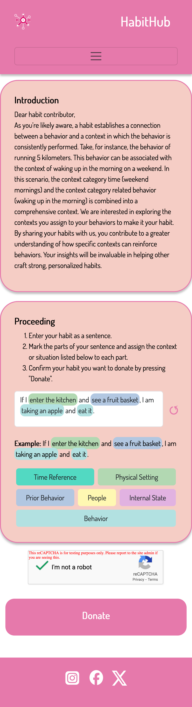
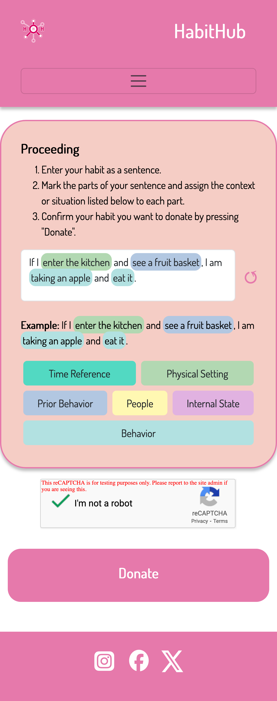
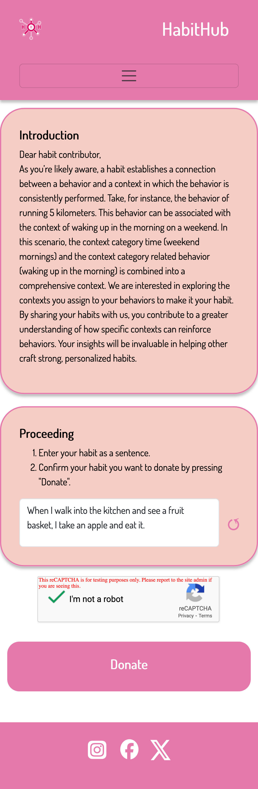
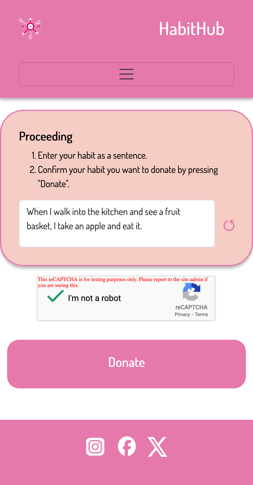
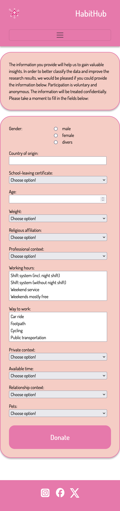
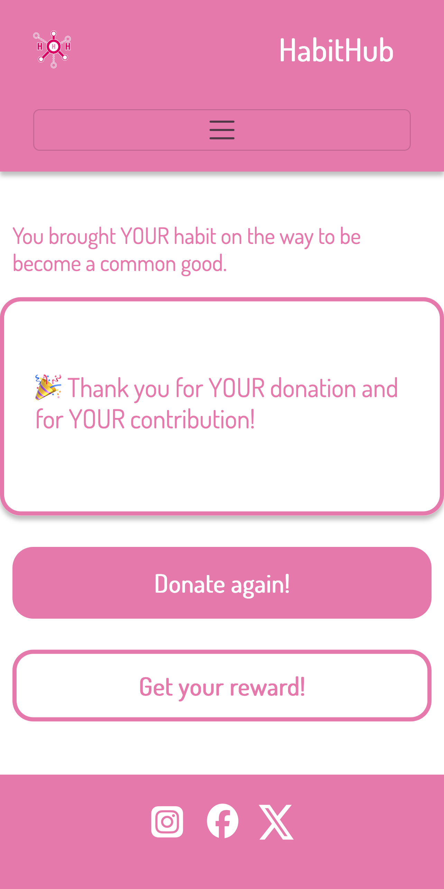

# User Manual

## Introduction

### Purpose of the app

Thank you for your interest in the Habit App and for choosing to use it! The Habit App is designed to collect everyday habits of individuals from diverse backgrounds and cultures. A habit typically connects a behavior (e.g., brushing teeth) with a context (e.g., after waking up in the morning) and is often performed subconsciously, requiring minimal cognitive effort.

Participation in the survey is entirely voluntary and anonymous, as it involves donating data to support research. The collected data aims to build a comprehensive database of habit elements, such as behaviors and their associated contexts. This database will facilitate research, for example, identifying optimal contexts for establishing beneficial habits, helping habits become stronger, or exploring cultural differences in habitual behaviors. With a better understanding of effective contexts for habits, it becomes easier to define and promote positive habits, ultimately supporting their reinforcement.

By donating your data, you are helping to better understand the habits of our society and help influence to develop beneficial habits.

The Habit App is developed, provided and researched in international collaboration by renowned Japanese, Canadian and German research institutions.

### Using the user manual

The user manual helps you to use and better understand the Habit app. To this end, the main areas of the Habit app are presented. The presentation follows the main pages of the Habit app. Screenshots of the Habit App or areas of the Habit App and a corresponding explanation will help you to understand the app.

## First steps

To use the Habit app, all you need is a standard browser, e.g. Firefox or Chrome, and a working internet connection, e.g. via WLAN or mobile data. It is best to use the Habit app with a tablet or smartphone. Installation is not required.

If you like the idea behind the Habit app and would like to support the research project over a longer period of time, create a bookmark on your home screen for quick access.

## Donate a habit

### Background information

As the understanding of what exactly a habit is may vary in different social and cultural environments, a method for surveying habits was developed and implemented in the Habit App that is adapted to this situation. The method is based on the assumption that clarification and information on the definition of the term habit has an impact on the quality of the data donation. According to this assumption, the following factors influence the survey:

- **General instructions**: General instructions include a welcome note and a definition of the term habit. The components of a habit are explained and at least one concrete example of a habit is given. The contribution of data donation to further research is explained.
- **Task description**: Task description contains a precise description of the sequence of steps from entering the habit to submitting the data donation.

By specifying or including these factors in combination, different possibilities for collecting a habit arise. These combinations are divided into four experiment groups and implemented by the Habit App. The experiment groups are made up as follows:

**Experiment group 1** - Habit App users are given comprehensive instructions by displaying the general instructions and task description. A habit is recorded according to a predefined scheme.

**Experiment group 2** - Habit app users are given partial instructions by displaying the task description. The habit is recorded in their own words without further instructions.

**Experiment group 3** - Habit app users are given partial instructions by displaying the general instructions. A habit is recorded according to a predefined scheme.

**Experiment group 4** - Habit app users are not given any instructions. The habit is recorded in their own words without any instructions.

### Step-by-step instructions

#### Step 1: Opening the Habit App

The Habit App is opened by clicking on the link in the browser. If a bookmark has been created for the Habit App on the start screen, the Habit App can also be opened via this.

#### Step 2: Donating a habit

When the Habit app is opened, one of the four possible experiment groups is determined and selected in the background (see section Donating a habit). If the Habit app is opened in a new browser session, one of the four experiment groups is randomly determined and selected. However, if a habit has already been donated via an existing browser session, this experiment group is adopted.

The selection of the experiment group has an influence on what content can be seen in the Habit app and the extent to which instructions for donating a habit are provided. When the Habit App is opened, the content of the start page is therefore determined by the experiment group (see section Behavior of the start page).

<!--

  

  
  

  

  
  

-->

**Experiment group 1**

  

    
  

  

    The page is divided into a header, main and footer area. The header area contains the navigation menu and options for language settings. The footer area contains links to social media related to the Habit app.
      
    The main area of the page is divided into three sub-areas - the top area with the general instructions, the middle area with the task description and the option to record the habit and the bottom area for sending the donation. The options for recording habits in the middle area are divided into an area for entering the habit and an area for marking context and behavior. After a habit has been entered, individual words or related word groups can be selected in the input field that represent a context or the behavior. The previously made selection of words can then be marked as a context or behavior by pressing the respective button below the input field. The selections made can be completely reset by pressing the ↺ button to the right of the input field.
      
    The confirmation (reCAPTCHA) that the Habit app user is a human and not a robot is a security precaution.
      
    Once the habit has been entered and selected in the input field, the habit can be donated by pressing the button at the bottom.
  

**Experiment group 2**

  

    
  

  

    The page is divided into a header, main and footer area. The header area contains the navigation menu and options for language settings. The footer contains links to social media related to the Habit app.
      
    The main area of the page is divided into two sub-areas - the upper area with the task description and the option to record the habit and the lower area for sending the donation. The options for recording habits in the middle area are divided into an area for entering the habit and an area for marking context and behavior. After a habit has been entered, individual words or related word groups can be selected in the input field, which represent a context or the behavior. The previously made selection of words can then be marked as a context or behavior by pressing the respective button below the input field. The selections made can be completely reset by pressing the ↺ button to the right of the input field.
      
    The confirmation (reCAPTCHA) that the Habit app user is a human and not a robot is a security precaution.
      
    Once the habit has been entered and selected in the input field, the habit can be donated by pressing the button at the bottom.
  

**Experiment group 3**

  

    
  

  

    The page is divided into a header, main and footer area. The header area contains the navigation menu and options for language settings. The footer area contains links to social media related to the Habit app.
      
    The main area of the page is divided into three sub-areas - the upper area with the general instructions, the middle area with the task description and the option to record the habit and the lower area for sending the donation. The habit is entered in the input field as a single sentence.
      
    The confirmation (reCAPTCHA) that the Habit app user is a human and not a robot is a security precaution.
      
    Once the habit has been entered and selected in the input field, the habit can be donated by pressing the button at the bottom.
  

**Experiment group 4**

  

    
  

  

    The page is divided into a header, main and footer area. The header area contains the navigation menu and options for language settings. The footer area contains links to social media related to the Habit app.
      
    The main area of the page is divided into two sub-areas - the upper area with the task description and the option to record the habit and the lower area for submitting the donation. The habit is entered in the input field as a single sentence.
      
    The confirmation (reCAPTCHA) that the Habit app user is a human and not a robot is a security precaution.
      
    Once the habit has been entered and selected in the input field, the habit can be donated by pressing the button at the bottom.
  

#### Step 3: Further voluntary information

After the habit has been recorded, the Habit App user has the opportunity to provide further voluntary information before the habit is finally donated.

The voluntary information requested includes the following demographic information about the Habit App user:

- Gender
- Age
- Body Weight
- Religious Affiliation
- Relationship Status
- Children and Pets
- Country of Origin
- Leisure Activities
- Educational Background
- Occupation and Everyday Working Life

The additional collection of voluntary information allows a donated habit to be better categorized, which further increases its value for research.

When donating several habits in succession or within a browser session, the additional voluntary information is not requested several times, but only during the first data donation.

  

    
  

  

    The page is divided into a header, main and footer area. The header area contains the navigation menu and options for language settings. The footer contains links to social media related to the Habit app.
      
    The main area of the page is divided into two sub-areas - the upper area with a brief explanation of the additional voluntary information and the lower area for entering the voluntary information and finally submitting the donation.
  

#### Step 4: Thanks

  

    
  

  

    The page is divided into a header, main and footer area. The header area contains the navigation menu and options for language settings. The footer contains links to social media related to the Habit app.
      
    The main area of the page is divided into two sub-areas - the upper area with a thank you and the lower area where another habit can be donated or a reward can be collected. If you select to donate a habit again, the Habit App home page is called up.
  

#### Step 5: Reward and visualization

In progress (Here it is only indicated that the donor is presented with a visualization that relates their own data donation to the totality of all data donations).

## Data protection and information security

In progress

## Help and support

In progress

## Glossary

### Explanation of the contexts

#### Time

**Markierung**: Time Reference

**Description**: Time is one of the most prominent contextual variables influencing habit formation. It serves as a consistent and predictable anchor, making it easier to associate specific behaviors with particular moments or periods. Temporal cues create a natural rhythm for habit repetition, reducing the reliance on conscious decision-making.

**Example**: "At 6:00 AM, I go for a jog before starting my workday." when time is explicitly stated or "In the Morning I go for a quick jog" when the time is not explicitly stated. Here, the time of day acts as a trigger, ensuring the habit is performed regularly and fits seamlessly into the individual’s schedule.

#### Physical Setting

**Label**: Physical Setting

**Description**: Physical setting refers to the specific location where a habit takes place. Environments play a crucial role in reinforcing behaviors because they provide visual or sensory cues that prompt habitual actions. A well-designed physical setting can strengthen habits by minimizing barriers and distractions.

**Example**: "In the kitchen, I drink a glass of water every time I see my water bottle on the counter." The kitchen and the visible water bottle work together as spatial and visual triggers for the behavior.

### Social Context

**Label**: People

**Description**: Social context involves the people or social environment present during a habitual action. Interactions with others can significantly influence habits, either by encouraging accountability, fostering collaboration, or modeling behavior. Social cues can reinforce habits positively or negatively, depending on the dynamics.

**Example**: “Whenever my colleagues take a coffee break, I join them for a quick chat.” The presence of others creates a social cue that reinforces the habit of participating in the group activity.

### Prior Behaviour

**Label**: Prior Behaviour

**Description**: Prior behavior highlights the sequential or chained nature of many habits. Often, one action naturally leads to another, creating a flow of activities that are interconnected. This chaining effect reduces cognitive effort and strengthens routines over time.

**Example**: "After brushing my teeth, I floss every night." The act of brushing serves as a natural precursor and trigger for flossing, making it easier to sustain the behavior as part of a routine.

### Internal State

**Label**: Internal State

**Description**: Internal state refers to the emotional or physiological conditions that cue habitual behaviors. Feelings such as stress, calm, hunger, or fatigue can prompt specific actions, as individuals seek to regulate or respond to their internal experiences.

**Example**: "When I feel stressed, I practice mindfulness meditation for 10 minutes to regain calm and focus." The emotional state of stress acts as a cue for a soothing and restorative habit.

## Legal information

In progress
