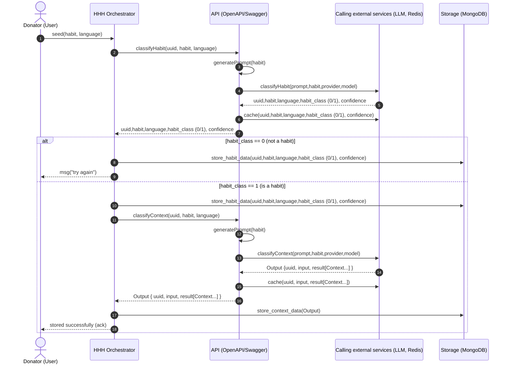

# Habit classifier based on LLM (determine whether it is a habit and extract the context information of the habit)

This project consists of three main parts:
- The core component is the [API-service](API-service): it can call the external LLM service to determine whether a sentence describes a habit and classify the context of the habit in the sentence. It also calls Redis to reduce the number of LLM calls and thus reduce costs.
- [HHH-service](HHH-service) acts as an intermediary service between users and [API-service](API-service): it can call the services of [API-service](API-service), perform operations, and store the results returned by [API-service](API-service) in the database.
- [hhh-frontend](hhh-frontend): This is the front-end I built with Vue. Users can enter their own sentences, select a language, and get a result.

## SequenceDiagram.
The following [sequenceDiagram](sequenceDiagram) shows the logic of the entire project in more detail



## Running with Docker
This is mainly for the startup of Docker of the core component [API-service](API-service)
To run the server, go to the [API-service](API-service) directory and do the following:

The first step is to find [example.env](API-service/src/openapi_server/example.env), change its name to .env, and then enter your own __REPLACE_WITH_YOUR_OPENAI_API_KEY__ and __REPLACE_WITH_YOUR_SCADS_API_KEY__, you can also choose the model you want to use.


```bash
docker compose up --build
```

and open your browser at `http://localhost:8080/docs/` to see the docs.


