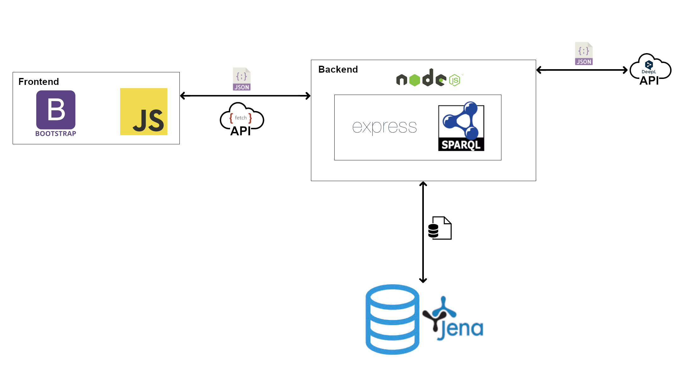

# Health Habit Hub

[](./app/public/pics/h3-logo.png)

## About

Welcome to our web application, designed to empower users to willingly contribute valuable data pertaining to their habits for research purposes. Our platform offers a seamless experience, allowing users to input data through a randomized selection of four different entry types:

- Closed: Predefined tasks and labels guide users to provide structured data
- Open: An empty text field encourages users to share unstructured information without any influence
- Closed-Task, Open data entry: Predefined task to ensure the right data is submitted but no labeling functionality to leave to user some freedom 
- Open-Task, Closed data entry: No Task, just a textfield with the buttons to label the provided data for well sturctured but less influenced data


#### Technological Foundation

- Frontend development is enriched by the Bootstrap framework and plain JavaScript.
- Backend data handling is efficiently executed using Node.js for a fast and synchronous processing experience.



#### Data Storage

The data is securely stored in a RDF database hosted on an [Apache Jena Fuseki](https://jena.apache.org/documentation/fuseki2/index.html) SPARQL server. This strategic approach not only ensures efficient data management but also paves the way for easier training of machine learning algorithms using the acquired data.

## Installation
Install [Docker](https://www.docker.com/) on you local system. \
If you want to edit/modify the app you also need [Node.js](https://nodejs.org)\
To run the app use: 

```
docker-compose up
```

## Usage

#### Online
When inside the TU-Dresden Network you can access the website under:
[http://swdev.wiwi.tu-dresden.de:3000](http://swdev.wiwi.tu-dresden.de:3000) 
And the database under: 
[http://swdev.wiwi.tu-dresden.de:3001](http://swdev.wiwi.tu-dresden.de:3001) 


#### Running the app locally
After running ```docker-compose up``` you can access the following sites: 

Open [app.localhost](https://app.localhost) to use the main application \
Open [fuseki.localhost](http://fuseki.localhost) to see/use the database \
Open [proxy.localhost](http://proxy.localhost) to see the dashboard 

## Repository
All the app files are found in /app  \
All docker files are found in the top repository \
The database schematics are in /init/schema.ttl which is extracted from Ontology.ttl
