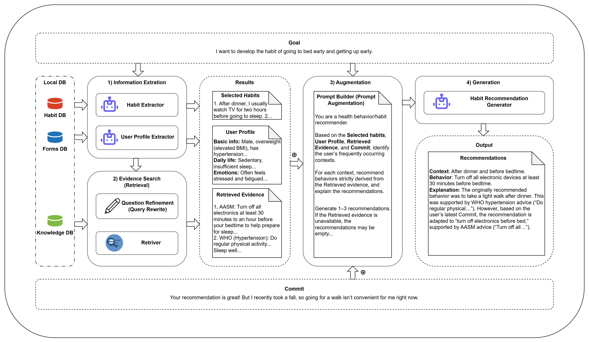
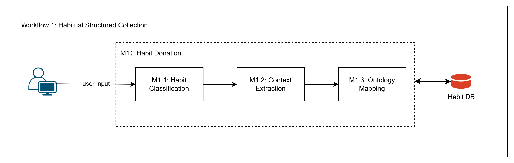
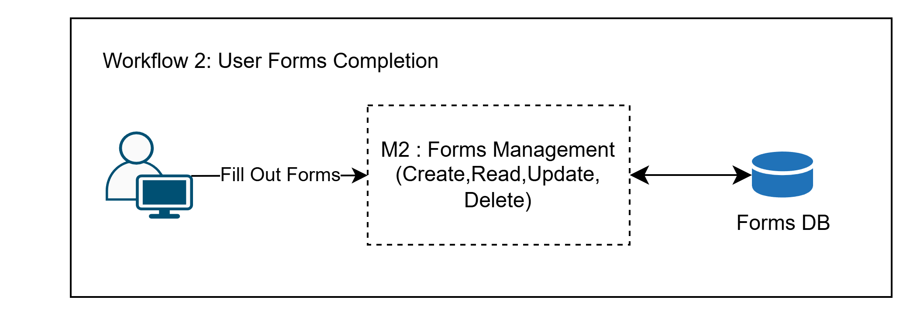
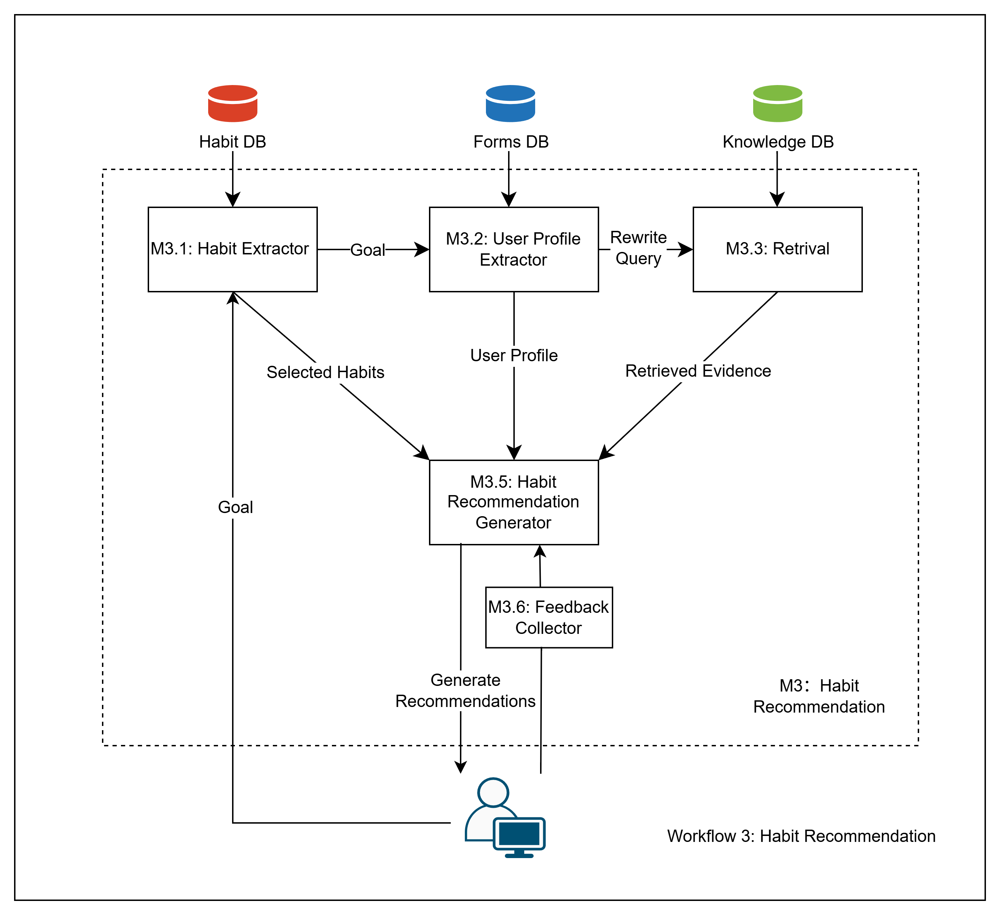
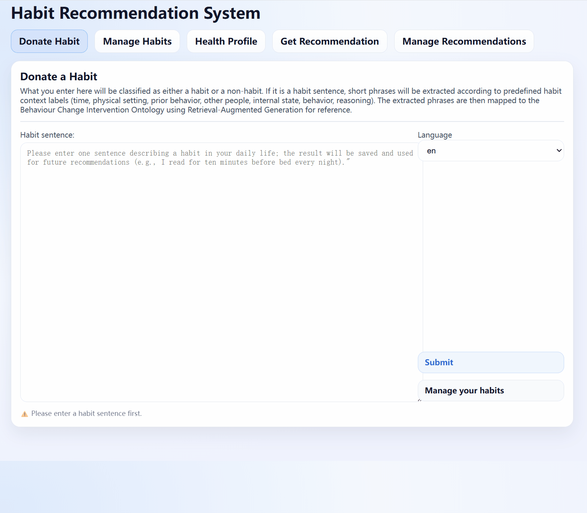
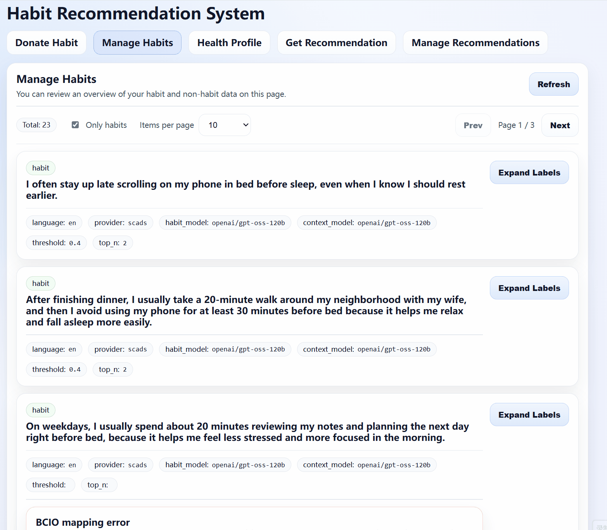
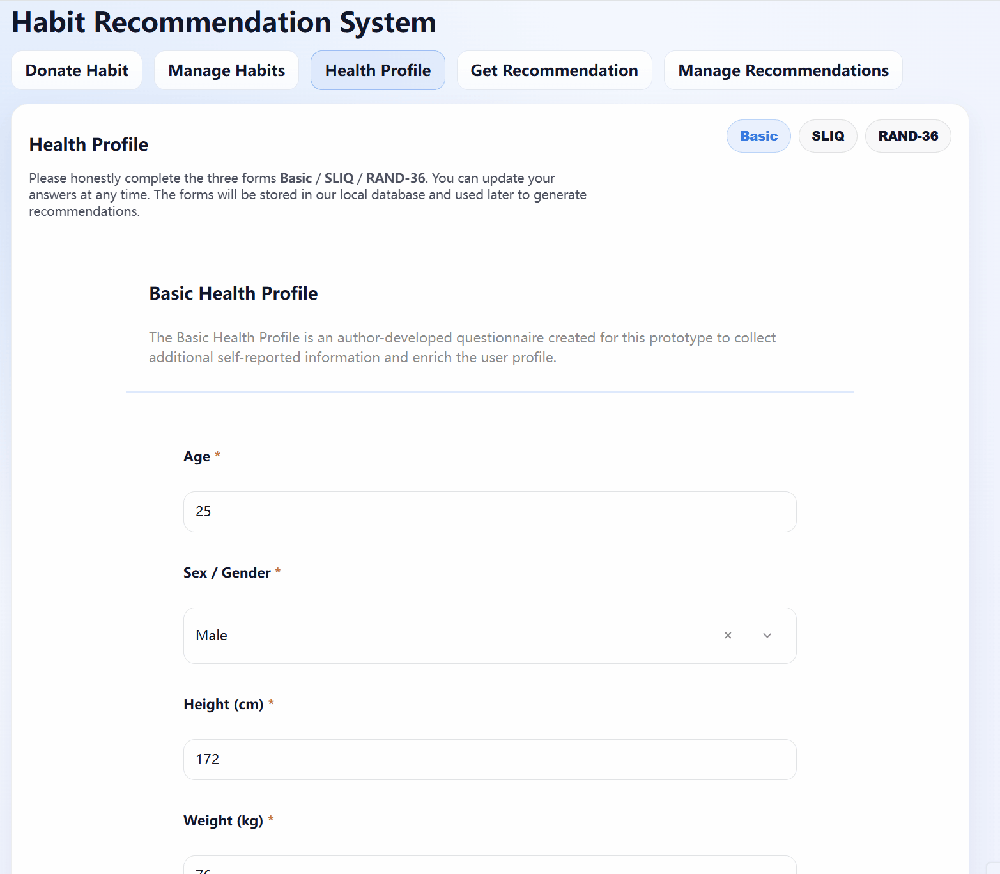
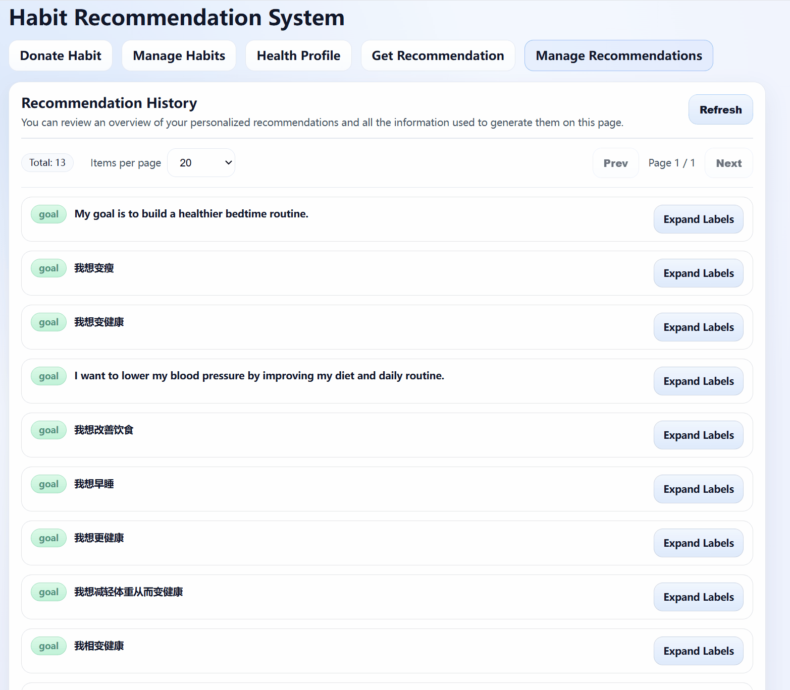
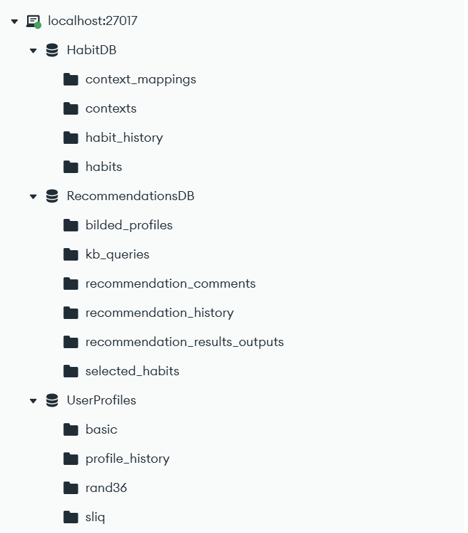
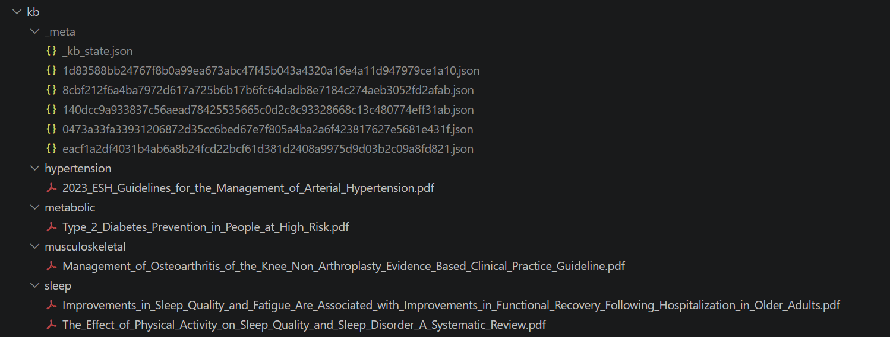

# Habit Recommender System

## Project Overview



A multi-LLM, RAG-supported prototype for collecting habits and generating personalized health habit recommendations.

## Features


### Workflow1: Habitual Structured Collection

This function supports the collection, storage, and display of users' daily habits in a local habit database.

* **M1.1: Habit Classification**
  Calls a large language model to determine whether the sentence entered by the user describes a habit. Redis is used as a cache.

* **M1.2: Context Extraction**
  Calls a large language model to identify the context of the user-entered habit sentence: **TIME, PHYSICAL SETTING, PRIOR BEHAVIOR, OTHER PEOPLE, INTERNAL STATE, BEHAVIOR,** and **REASONING**. Redis is used as a cache.

* **M1.3: Ontology Mapping**
  Maps extracted context phrases to concepts in the **Behaviour Change Intervention Ontology (BCIO)**. Retrieval uses a linear weighted combination of dense and sparse vectors.

---


### Workflow2: User Forms Completion

This function supports the completion, storage, and display of three user forms in a local forms database:

* Basic Form (designed by the author)
* Simple Lifestyle Indicator Questionnaire (SLIQ)
* RAND 36-Item Health Survey (RAND-36)



---


### Workflow3: Habit Recommendation

Based on the user-entered goal, the system selects suitable habits, generates an appropriate user profile, performs RAG retrieval, and then generates recommendations using these results together with the user's comments on recommendations for the same goal (from the comments collection). The recommendation results are stored in a local recommendation database and displayed in the UI.



* **M3.1: Habit Extractor**
  Uses a large language model to select suitable habits from the user's local habit database based on the user's goal statement, and to generate a habit summary. The selected habits (including context labels but excluding BCIO mapping results) are passed to `M3.5: Habit Recommendation Generator`, and the habit summary can optionally be used as part of the RAG query for `M3.3: Retrieval`. Redis caching is implemented.

* **M3.2: User Profile Extractor**
  Uses a large language model to extract `profile_detailed` and `profile_summary` from the user's local forms database based on the user's goal statement. The `profile_summary` is passed to `M3.5: Habit Recommendation Generator`, while `profile_detailed`, including a rewritten version of the user's goal statement optimized for use as a RAG query, is used as part of the RAG query for `M3.3: Retrieval`. Redis caching is implemented.

* **M3.3: Retrieval**
  Uses a large language model to generate a one-time summary for each PDF document in the user's local knowledge base (KB). Only dense vectors are used. The local KB fully supports extensible CRUD operations (create, read, update, delete) and stores KB metadata in `_meta`.

* **M3.5: Habit Recommendation Generator**
  Calls a large language model to generate appropriate behavior or habit recommendations based on all provided inputs. Redis caching is implemented.

* **M3.6: Feedback Collector**
  Stores a user comment for a recommendation request, thereby forming an explicit feedback loop.

## Demo

### Habit Donation

⚠️ The first time a habit is donated, the system needs to download the BGE-M3 embedding model and build the index, which may take around 20 minutes. Please be patient :D

### Manage Habits


### Health Profile


### Get Recommendation

⚠️ The first recommendation will trigger the download of the BGE-M3 embeddings and the indexing of the PDFs in the knowledge base. The processing time depends on the length and number of the PDFs. Please be patient :D
### Manage Recommendations


### MongoDB


### Local Knowledge Base


* By default, it contains 6 PDFs (guidelines).
* Users can customize the Local Knowledge Base at any time. During `M3.3: Retrieval`, any changes to the Local Knowledge Base will be detected and handled automatically.
* Please use the domain name as the name of the category folder.
* The PDF filename should be the title of the paper or guideline, with words separated by underscores.

## Tech Stack

* **Frontend:** Vue
* **Backend:** FastAPI
* **Vector Database:** Milvus
* **Embedding Model:** BAAI/bge-m3 (multilingual)

  * Dense and sparse vectors are used for ontology mapping
  * Only dense vectors are used for the knowledge base
* **Large Language Models:** OpenAI models and SCADS AI models
* **Cache:** Redis
* **Local Database:** MongoDB

## Installation and Running (Best Practice)

The author has only tested the project successfully on Windows.

### 1. Install Docker

[Download Docker Desktop for Windows (AMD64)](https://www.docker.com/products/docker-desktop/)

### 2. Set Up Milvus

#### 2.1 Download `docker-compose.yml`

```bash
# macOS / Linux (using wget)
wget https://github.com/milvus-io/milvus/releases/download/v2.5.14/milvus-standalone-docker-compose.yml -O docker-compose.yml
```

```powershell
# Windows (using PowerShell)
Invoke-WebRequest -Uri "https://github.com/milvus-io/milvus/releases/download/v2.5.14/milvus-standalone-docker-compose.yml" -OutFile "docker-compose.yml"
```

#### 2.2 Start the Milvus service

Run the following command in the directory containing the `docker-compose.yml` file:

```bash
docker compose up -d
```

### 3. Install Local MongoDB

* MongoDB installation guide for Windows:
  https://www.mongodb.com/docs/v7.0/tutorial/install-mongodb-on-windows/

#### 3.1 Install `mongosh`

https://www.mongodb.com/try/download/shell

#### 3.2 Install MongoDB Community Server (including MongoDB Compass)

https://www.mongodb.com/try/download/community

#### 3.3 Create a default local connection

Create a completely default connection to: localhost:27017

### 4. Configure Environment Variables

Rename `example.env` to `.env` and add your API keys.

### 5. Start the Project with Docker

In the project's root directory, run:

```bash
docker compose up -d
```

## Project Structure

* `API-service` — Provides APIs to `HHH-service` on port 8080
* `HHH-service` — Calls the APIs provided by `API-service`, composes new APIs, and provides them to the frontend on port 8081
* `habit-recommendation-system-ui` — Calls the APIs provided by `HHH-service` on port 5173

## Author / Contact

* **Author:** Jingting Hua
* **Contact:** [jingting.hua@mailbox.tu-dresden.de](mailto:jingting.hua@mailbox.tu-dresden.de)
* This software was developed as part of my Diplomarbeit and is intended for research purposes only.