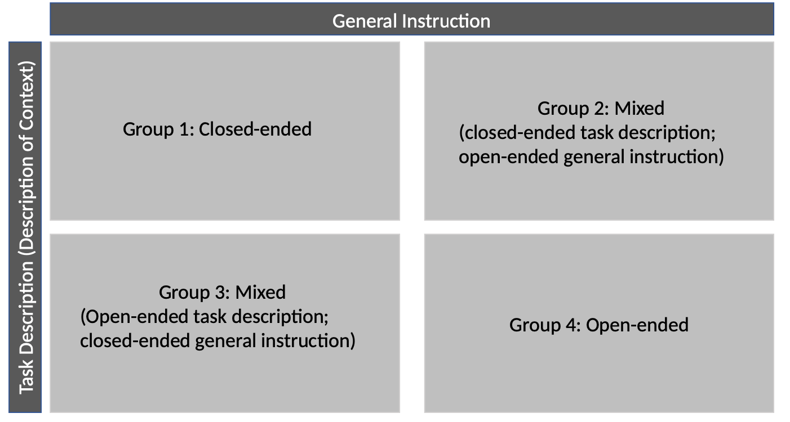

# General Experimental Design

Understanding the mechanisms of habit formation and maintenance is crucial for developing effective interventions that promote positive behavioral change [^1]. This study investigates two research questions.

First, it seeks to understand how participants define and report their habits. The goal is to create a robust database that can serve as a foundation for advancing the understanding of habits, particularly in the context of behavioral change interventions. This database will help identify actionable factors in habit formation that can support individuals in developing healthier habits across various contexts and integrating them into their daily routines [^2].

Second, the study examines how the design of instructions impacts response quality. Previous research has demonstrated that the specificity and detail of instructions significantly influence the depth and accuracy of participant responses [^3], [^4]. To address these effects, the study employs a design with four experimental groups, each receiving a different level of detail and background information in their instructions.

To answer these research questions, an online web interface was developed, allowing users to contribute habits along with their associated contexts to an open-source habit database called the **Health Habit Hub**. Contributors describe their habits in a sentence and identify the relevant contexts within their descriptions using color-coded markers in the graphical user interface. Each participant is randomly assigned to one of four experimental groups, and this assignment remains constant throughout their session. Participants may contribute multiple habits, but this does not influence their group assignment, as it is determined at the browser session level.

# Habit Context

Habit formation and maintenance are inherently context-dependent, as highlighted by habit studies and cognitive studies on behavior [^5], [^6], [^7]. Contexts are crucial in initiating and sustaining habits, serving as anchors that trigger automatic behaviors. Without these contextual integration, habits lose their consistency and are less likely to persist over time [^8]. Understanding the relationship between habits and their contexts is therefore essential for developing interventions that promote positive behaviors or disrupt maladaptive ones.

This study seeks to advance our understanding of how specific contexts influence habit formation and maintenance. By exploring these dynamics, we aim to identify strategies for tailoring interventions that leverage context factors to optimize the habit-formation process. Such insights are valuable not only for individuals striving to adopt healthier lifestyles but also for broader applications in fields such as healthcare, education, and workplace productivity.

Through the systematic analysis of habits and their contexts, donated by volunteers, we aim to generate actionable insights for designing personalized and scalable habit-based interventions. The contexts we are multidimensional and include **time**, **physical setting**, **social context**, **prior behavior**, and **internal state**. Since multiple dimensions of contexts may often be present within a single habit description, participants are instructed to mark all relevant context dimension they identify.

## Time

Time is one of the most prominent context dimension influencing habit formation. It serves as a consistent and predictable anchor, making it easier to associate specific behaviors with particular moments or periods. Temporal cues create a natural rhythm for habit repetition, reducing the reliance on conscious decision-making.

### Example

"At 6:00 AM, I go for a jog before starting my workday." when time is explicitly stated or "In the Morning I go for a quick jog" when the time is not explicitly stated. Here, the time of day acts as a trigger, ensuring the habit is performed regularly and fits seamlessly into the individual’s schedule.

## Physical Setting

Physical setting refers to the specific location where a habit takes place. Environments play a crucial role in reinforcing behaviors because they provide visual or sensory cues that prompt habitual actions. A well-designed physical setting can strengthen habits by minimizing barriers and distractions.

### Example

"In the kitchen, I drink a glass of water every time I see my water bottle on the counter." The kitchen and the visible water bottle work together as spatial and visual triggers for the behavior.

## Social Context

Social context involves the people or social environment present during a habitual action. Interactions with others can significantly influence habits, either by encouraging accountability, fostering collaboration, or modeling behavior. Social cues can reinforce habits positively or negatively, depending on the dynamics.

### Example

“Whenever my colleagues take a coffee break, I join them for a quick chat.” The presence of others creates a social cue that reinforces the habit of participating in the group activity.

## Prior Behavior

Prior behavior highlights the sequential or chained nature of many habits. Often, one action naturally leads to another, creating a flow of activities that are interconnected. This chaining effect reduces cognitive effort and strengthens routines over time.

### Example

"After brushing my teeth, I floss every night." The act of brushing serves as a natural precursor and trigger for flossing, making it easier to sustain the behavior as part of a routine.

## Internal State

Internal state refers to the emotional or physiological conditions that cue habitual behaviors. Feelings such as stress, calm, hunger, or fatigue can prompt specific actions, as individuals seek to regulate or respond to their internal experiences.

### Example

"When I feel stressed, I practice mindfulness meditation for 10 minutes to regain calm and focus." The emotional state of stress acts as a cue for a soothing and restorative habit.

## Other

While the main categories of habit contexts are well-defined, other unique or combined variables can also act as triggers. These might include sensory stimuli, external events, or personal goals that influence habitual actions in ways not captured by the primary categories.

### Example

"Whenever I hear my alarm, I immediately write down three things I am grateful for." Here, the sound of the alarm serves as an external sensory cue, creating a unique and personalized habit context.

# 2x2 Experimental Design

The 2x2 experimental design is a structured approach to study how the level of constraint in task instructions and  general description formats impacts participants' responses. It involves two independent variables—**Task Type** (Closed vs. Open) and **General Description Format** (Closed vs. Open)—resulting in four experimental groups. Each group combines one level of task description with one level of general instruction description, providing insights into how different levels of structure influence data quality, diversity, and consistency. The 2x2 experimental design allows to explore how variations in task and general description format influence data quality. We examine how closed versus open formats of task description and general instruction affect engagement as well as the richness and diversity of responses. This design also lets us investigate interaction effects, such as whether open-ended tasks paired with open descriptions foster creativity at the expense of comparability. By analyzing these factors, we aim to identify the best balance of structure and flexibility to meet our research goals, whether prioritizing standardization or maximizing data richness.

## Variables in the Design

1. **Task Description Format**:

   - **Closed**: Participants are given specific, well-defined tasks, which focus on reporting habits within predefined categories. These participants receive extensive guidance to ensure their responses are aligned with the experiment's objectives. For example, they are shown predefined contexts such as **time**, **physical setting**, **social context**, **prior behavior**, and **internal state**. Participants also see examples like "When arriving home after work (context), I immediately change into workout clothes and go to the gym (behavior)." This structured approach minimizes ambiguity and ensures consistency in the data collected.
   - **Open**: Participants have the freedom to report their habit incluing its context as they want. They receive less guidance about specific categories or examples, encouraging a broader range of responses and more creativity.
     
2. **General Instruction Format**:

   - **Closed-Description**: Participants describe their habits using a predefined structure. This includes categories such as **time**, **physical setting**, **social context**, **prior behavior**, and **internal state**, each with specific prompts to ensure detailed responses. For instance, participants might be instructed to complete a template like: "When [context], I [behavior]." To support this, they are presented with examples for each category:

     - **Time**: "At 6:00 AM, I go for a jog."
     - **Physical setting**: "In the kitchen, I drink water when I see my water bottle."
     - **Social context**: "With my gym buddy, I complete a workout session."
     - **Prior behavior**: "After brushing my teeth, I floss every night."
     - **Internal state**: "When feeling stressed, I practice mindfulness meditation."

     These examples help participants align their responses to the predefined structure while ensuring all relevant context dimensions are captured.
     
   - **Open-Description**: Participants only get minimal instruction to not be biased to the predefined context dimensions and are free to describe their habits (including context) in their own words. This format aims to capture richer and more diverse responses but relies on the participants' initiative and understanding.

## Groups

- **Group 1: Closed-Task, Closed-Description**:
  - Full guidance is provided. Participants are given predefined tasks description and are required to use structured input formats. Before starting with data entry, they see examples for each context (time, physical setting, etc.) and are prompted to align their responses with the given categories.

- **Group 2: Closed-Task, Open-Description**:
  - Participants are assigned specific tasks without being prompted with much general instruction information. They receive examples of habits in the task description to help them understand the scope of their responses but do not receive much explanation in the general instruction.

- **Group 3: Open-Task, Closed-Description**:
  - Minimal guidance is offered regarding task execution and data entry. However, before starting data entry, the participants receives comprehensive instructions with examples.

- **Group 4: Open-Task, Open-Description**:
  - This group receives the least amount of guidance. Participants are free to report about their habit and its context dimension as they like. They are not shown specific categories or examples, allowing for maximum flexibility and creativity.

This differentiated support ensures that each group aligns with its designated level of task and description flexibility, enabling the study to investigate how varying degrees of structure influence the quality and diversity of the data collected.

<!---
References 
they are note printed as a separate section in the output file only as footnotes.
-->

[^1]: Chung, A., Lessard, L., & Andreev, P. (2021). Information systems promoting habit formation for users: From theories to design principles. Information Systems, 6, 14–2021.
[^2]: Stark, J., Weimann, T., Reinsch, F., Hickmann, E., Kählig, M., Gißke, C., & Richter, P. (2023). Building Habits in the Digital Age: Incorporating Psychological Needs and Knowledge from Practitioners to Inform the Design of Digital Therapeutics. Wirtschaftsinformatik 2023 Proceedings. https://aisel.aisnet.org/wi2023/36
[^3]: Ogunseye, S., Parsons, J., & Afolabi, D. (2021, August). Training-Induced Class Imbalance in Crowdsourced Data.

[^4]: Ogunseye, S., & Parsons, J. (2021, September). Collecting Useful Information from Crowds: Is Experience Required?

[^5]: Duhigg, C. (2012). The power of habit: Why we do what we do in life and business. Random House.

[^6]: Reinsch, F., Weimann, T. G., & Stark, J. (2024, October 18). Tailoring Health: Contextual Variables In Health Recommender Systems. Proceedings of the 6th Workshop on Health Recommender Systems co-located with ACM RecSys 2024, Bari, Italy. https://ceur-ws.org/Vol-3823/1_Reinsch_tailoring_159.pdf

[^7]: Verplanken, B. (Ed.). (2018). The psychology of habit: Theory, mechanisms, change, and contexts. Springer.

[^8]: Stawarz, K., Cox, A. L., & Blandford, A. (2015). Beyond Self-Tracking and Reminders: Designing Smartphone Apps That Support Habit Formation. Proceedings of the 33rd Annual ACM Conference on Human Factors in Computing Systems, 2653–2662. https://doi.org/10.1145/2702123.2702230
