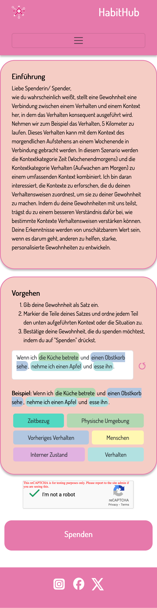
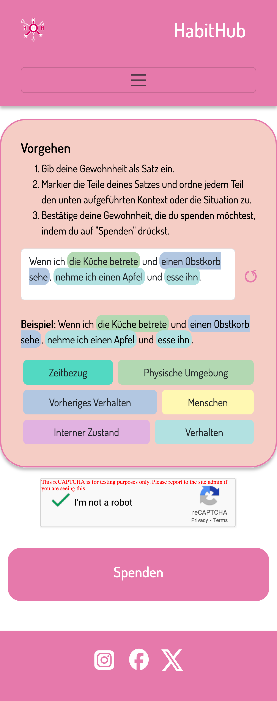
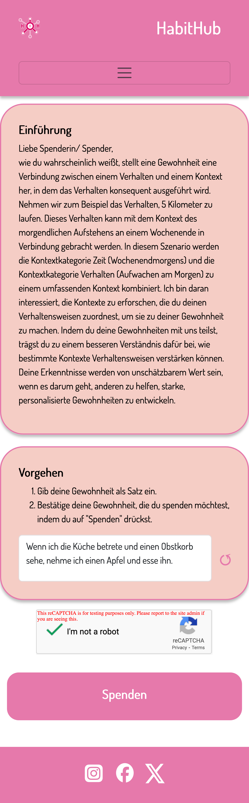
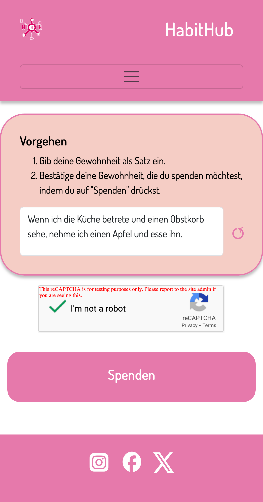
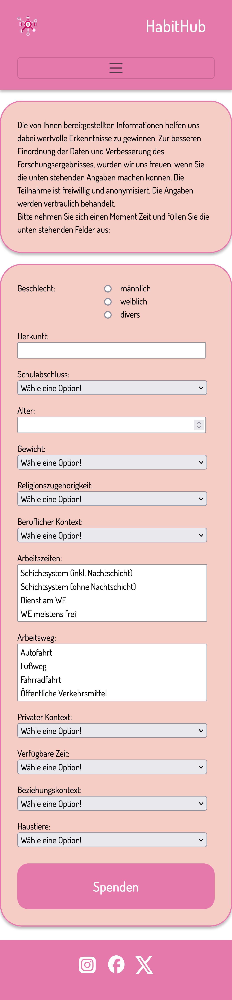
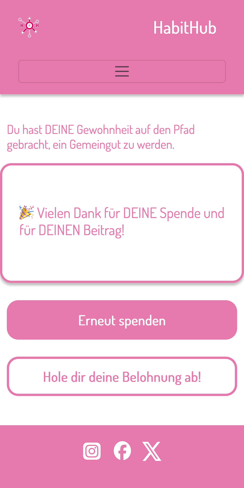

# Benutzerhandbuch

## Einführung

### Zweck der App

Vielen Dank, dass Sie sich für die Habit App interessieren und diese nutzen möchten. Der Zweck der Habit App ist es, alltägliche Gewohnheiten von Menschen unterschiedlicher Herkunft und Kultur zu erheben. Bei einer Gewohnheit handelt es sich um erlerntes oder antrainiertes Verhalten, das situationsbedingt und überwiegend unterbewusst ausgeführt wird. Die Erhebung erfolgt als freiwillige und anonyme Datenspende.

Durch die Datenspenden soll eine zur Forschung freigegebene Datenbasis für Gewohnheiten aufgebaut und bereitgestellt werden. Auf Grundlage dieser Datenbasis wird eine weiterführende Forschung ermöglicht, z.B. hinsichtlich etablierter Gewohnheiten mit Bezug zu einer Situation und den Gegebenheiten im Alltag oder auch zu sozialer Herkunft und kulturellem Hintergrund. Mit einem besseren Verständnis zu alltäglichen Gewohnheiten lassen sich förderliche oder hinderliche Verhaltensmuster zu verschiedenen Aspekten mit gesellschaftlicher Relevanz besser erkennen und untersuchen. Darüber hinaus kann ein besseres Verständnis passfähigere oder innovative Lösungen für unterschiedliche gesellschaftliche Bereiche fördern, z.B. eine gesündere Ernährung oder eine effektivere Tagesplanung.

Mit Ihrer Datenspende tragen Sie also dazu bei, Teile der Gesellschaft besser zu verstehen und Einfluss auf deren Weiterentwicklung zu nehmen.

Die Habit App wird in internationaler Zusammenarbeit von renommierten japanischen, kanadischen und deutschen Forschungseinrichtungen entwickelt, bereitgestellt und beforscht.

### Anwendung des Benutzerhandbuchs

Das Benutzerhandbuch hilft Ihnen dabei die Habit App zu bedienen und besser zu verstehen. Dazu werden die wesentlichen Bereiche der Habit App vorgestellt. Die Vorstellung erfolgt entlang der wesentlichen Seiten der Habit App. Dabei unterstützen Bildschirmfotos der Habit App oder von Bereichen aus dieser sowie eine zugehörige Erklärung das Verständnis.

## Erste Schritte

Um die Habit App nutzen zu können benötigen Sie lediglich einen gängigen Browser, z.B. Firefox oder Chrome und eine funktionierende Internetverbindung, z.B. per WLAN oder mobile Daten. Nutzen Sie die Habit App am besten mit einem Tablet oder Smartphone. Eine Installation ist nicht erforderlich.

Gefällt Ihnen die Idee hinter der Habit App und möchten Sie das Forschungsvorhaben über längere Zeit unterstützen, erstellen Sie sich ein Lesezeichen auf Ihrem Startbildschirm für einen schnellen Zugriff.

## Spenden einer Gewohnheit

### Hintergrundinformationen

Da es in unterschiedlichen sozialen und kulturellen Umgebungen ein möglicherweise variierendes Verständnis dazu gibt, was genau eine Gewohnheit ist oder damit gemeint sein kann, wurde eine an diese Situation angepasste Methode zur Erhebung von Gewohnheiten entwickelt und in der Habit App umgesetzt. Dabei beruht die Methode auf der Annahme, dass sich die Aufklärung und Hinweise zur Definition des Begriffs Gewohnheit auf die Qualität der Datenspende auswirkt. Nach dieser Annahme beeinflussen folgende Faktoren die Erhebung:

- **Allgemeine Instruktionen**: Dabei handelt es sich um eine Begrüßung und Definition des Begriffs Gewohnheit. Der Bestandteile einer Gewohnheit werden erläutert und mindestens ein konkretes Beispiel für eine Gewohnheit gegeben. Der Beitrag der Datenspende zur weiterführenden Forschung wird erläutert.
- **Aufgabengeschreibung**: Eine genaue Beschreibung der Schrittfolge von der Eingabe der Gewohnheit bis zum Absenden zur Datenspende.

Durch das Vorgeben oder Enthalten dieser Faktoren in Kombination ergeben sich verschiedene Möglichkeiten zur Erhebung einer Gewohnheit. Diese Kombinationen werden in vier Experimentgruppen unterteilt und durch die Habit App umgesetzt. Die Experimentgruppen setzen sich wie folgt zusammen:

**Experimentgruppe 1** - Den Habit App-Nutzenden wird eine *umfangreiche Anleitung* gegeben, indem die allgemeinen Instruktionen und die Aufgabenbeschreibung angezeigt werden. Die Erhebung einer Gewohnheit erfolgt nach einem vorgegebenen Schema.

**Experimentgruppe 2** - Den Habit App-Nutzenden wird eine *teilweise Anleitung* gegeben, indem die Aufgabenbeschreibung angezeigt wird. Die Erhebung einer Gewohnheit erfolgt in eigenen Worten ohne weitere Vorgaben.

**Experimentgruppe 3** - Den Habit App-Nutzenden wird eine *teilweise Anleitung* gegeben, indem die allgemeinen Instruktionen angezeigt werden. Die Erhebung einer Gewohnheit erfolgt nach einem vorgegebenen Schema.

**Experimentgruppe 4** - Den Habit App-Nutzenden wird *keine Anleitung* gegeben. Die Erhebung einer Gewohnheit erfolgt in eigenen Worten ohne weitere Vorgaben.

### Schritt für Schritt Anleitung

#### Schritt 1: Aufrufen der Habit App

Die Habit App wird durch das Aufrufen des Links im Browser geöffnet. Wurde zur Habit App ein Lesezeichen auf dem Startbildschirm erstellt, lässt sich die Habit App darüber ebenso öffnen.

#### Schritt 2: Spenden einer Gewohnheit

Beim Öffnen der Habit App erfolgt im Hintergrund die Bestimmung und Auswahl einer der vier möglichen Experimentgruppen (siehe Abschnitt [Spenden einer Gewohnheit](Spenden_einer_Gewohnheit)). Wurde die Habit App in einer neuen Browser-Sitzung geöffnet, dann wird eine der vier Experimentgruppen zufällig bestimmt und ausgewählt. Wurde jedoch zuvor bereits eine Gewohnheit über eine bestehenden Browser-Sitzung gespendet, dann wird diese Experimentgruppe übernommen.

Die Auswahl der Experimentgruppe hat Einfluss darauf, welche Inhalte in der Habit App zu sehen sind und in welchem Umfang eine Anleitung zur Spende einer Gewohnheit erfolgt. Beim Aufrufen der Habit App wird der Inhalt der Startseite daher durch die Experimentgruppe bestimmt (siehe Abschnitt [Verhalten der Startseite](1.1_Verhalten_der_Startseite)).

**Experimentgruppe 1**

  

    
  

  

    Die Seite ist in einen Kopf-, Haupt- und Fußbereich aufgeteilt. Im Kopfbereich befindet sich das Navigationsmenü und Möglichkeiten zur Spracheinstellung. Im Fußbereich befinden sich Verlinkungen auf Soziale Medien, die im Zusammenhang mit der Habit App stehen.
      
    Der Hauptbereich der Seite ist in drei Unterbereiche aufgeteilt - den <em>oberen Bereich</em> mit den allgemeinen Instruktionen, dem <em>mittleren Bereich</em> mit der Aufgabenbeschreibung und der Möglichkeit zur Erfassung der Gewohnheit und dem <em>unteren Bereich</em> zum Absenden der Spende. Die Möglichkeiten zur Erfassung der Gewohnheiten im mittleren Bereich unterteilen sich in einen Bereich zur <em>Eingabe der Gewohnheit</em> und einen Bereich zur <em>Markierung von Kontext und Verhalten</em>. Nachdem eine Gewohnheit eingegeben wurde, können einzelne Wörter oder zusammenhängende Wortgruppen im Eingabefeld, die einen Kontext oder das Verhalten darstellen, ausgewählt werden. Danach kann die zuvor getroffene Auswahl an Wörtern als ein Kontext oder Verhalten markiert werden, indem die jeweilige Schaltfläche unterhalb des Eingabefeldes betätigt wird. Die vorgenommenen Markierungen lassen sich durch Betätigung der Schaltfläche ↺ rechts neben dem Eingabefeld vollständig zurücksetzen.
      
    Bei der Bestätigung (reCAPTCHA), dass der Habit App-Nutzende ein Mensch und kein Roboter ist, handelt es sich um eine Sicherheitsvorkehrung.
      
    Wurde die Gewohnheit im Eingabefeld eingegeben und markiert, kann die Gewohnheit durch Betätigung der Schaltfläche im unteren Bereich gespendet werden.
  

**Experimentgruppe 2**

  

    
  

  

    Die Seite ist in einen Kopf-, Haupt- und Fußbereich aufgeteilt. Im Kopfbereich befindet sich das Navigationsmenü und Möglichkeiten zur Spracheinstellung. Im Fußbereich befinden sich Verlinkungen auf Soziale Medien, die im Zusammenhang mit der Habit App stehen.
      
    Der Hauptbereich der Seite ist in zwei Unterbereiche aufgeteilt - den <em>oberen Bereich</em> mit der Aufgabenbeschreibung und der Möglichkeit zur Erfassung der Gewohnheit und dem <em>unteren Bereich</em> zum Absenden der Spende. Die Möglichkeiten zur Erfassung der Gewohnheiten im mittleren Bereich unterteilen sich in einen Bereich zur <em>Eingabe der Gewohnheit</em> und einen Bereich zur <em>Markierung von Kontext und Verhalten</em>. Nachdem eine Gewohnheit eingegeben wurde, können einzelne Wörter oder zusammenhängende Wortgruppen im Eingabefeld, die einen Kontext oder das Verhalten darstellen, ausgewählt werden. Danach kann die zuvor getroffene Auswahl an Wörtern als ein Kontext oder Verhalten markiert werden, indem die jeweilige Schaltfläche unterhalb des Eingabefeldes betätigt wird. Die vorgenommenen Markierungen lassen sich durch Betätigung der Schaltfläche ↺ rechts neben dem Eingabefeld vollständig zurücksetzen.
      
    Bei der Bestätigung (reCAPTCHA), dass der Habit App-Nutzende ein Mensch und kein Roboter ist, handelt es sich um eine Sicherheitsvorkehrung.
      
    Wurde die Gewohnheit im Eingabefeld eingegeben und markiert, kann die Gewohnheit durch Betätigung der Schaltfläche im unteren Bereich gespendet werden.
  

**Experimentgruppe 3**

  

    
  

  

    Die Seite ist in einen Kopf-, Haupt- und Fußbereich aufgeteilt. Im Kopfbereich befindet sich das Navigationsmenü und Möglichkeiten zur Spracheinstellung. Im Fußbereich befinden sich Verlinkungen auf Soziale Medien, die im Zusammenhang mit der Habit App stehen.
      
    Der Hauptbereich der Seite ist in drei Unterbereiche aufgeteilt - den <em>oberen Bereich</em> mit den allgemeinen Instruktionen, dem <em>mittleren Bereich</em> mit der Aufgabenbeschreibung und der Möglichkeit zur Erfassung der Gewohnheit und dem <em>unteren Bereich</em> zum Absenden der Spende. Die Gewohnheit wird in das Eingabefeld als einzelner Satz eingegeben.
      
    Bei der Bestätigung (reCAPTCHA), dass der Habit App-Nutzende ein Mensch und kein Roboter ist, handelt es sich um eine Sicherheitsvorkehrung.
      
    Wurde die Gewohnheit im Eingabefeld eingegeben und markiert, kann die Gewohnheit durch Betätigung der Schaltfläche im unteren Bereich gespendet werden.
  

**Experimentgruppe 4**

  

    
  

  

    Die Seite ist in einen Kopf-, Haupt- und Fußbereich aufgeteilt. Im Kopfbereich befindet sich das Navigationsmenü und Möglichkeiten zur Spracheinstellung. Im Fußbereich befinden sich Verlinkungen auf Soziale Medien, die im Zusammenhang mit der Habit App stehen.
      
    Der Hauptbereich der Seite ist in zwei Unterbereiche aufgeteilt - den <em>oberen Bereich</em> mit der Aufgabenbeschreibung und der Möglichkeit zur Erfassung der Gewohnheit und dem <em>unteren Bereich</em> zum Absenden der Spende. Die Gewohnheit wird in das Eingabefeld als einzelner Satz eingegeben.
      
    Bei der Bestätigung (reCAPTCHA), dass der Habit App-Nutzende ein Mensch und kein Roboter ist, handelt es sich um eine Sicherheitsvorkehrung.
      
    Wurde die Gewohnheit im Eingabefeld eingegeben und markiert, kann die Gewohnheit durch Betätigung der Schaltfläche im unteren Bereich gespendet werden.
  

#### Schritt 3: Weitere freiwillige Angaben

Nach dem die Gewohnheit erfasst wurde, hat der Habit App-Nutzende die Möglichkeit, weitere freiwillige Angaben zu machen, **bevor die Gewohnheit abschließend gespendet wird**.

Bei den abgefragten freiwilligen Angaben handelt es sich um die folgenden demografischen Informationen zur Habit App-nutzenden Person:

- Geschlecht
- Alter
- Körpergewicht
- Religionszugehörigkeit
- Beziehungsstatus
- Kinder und Haustiere
- Herkunft
- Freizeitgestaltung
- Bildungshintergrund
- Beruf und Berufsalltag

Durch die zusätzliche Erfassung der freiwilligen Angaben kann eine gespendete Gewohnheit besser eingeordnet werden, was den Beitrag zur weiterführenden Forschung nochmals erhöht.

Beim Spenden mehrerer Gewohnheiten hintereinander oder innerhalb einer Browser-Sitzung werden die weiteren freiwilligen Angaben nicht mehrmals abgefragt, sondern nur bei der ersten Datenspende.

  

    
  

  

    Die Seite ist in einen Kopf-, Haupt- und Fußbereich aufgeteilt. Im Kopfbereich befindet sich das Navigationsmenü und Möglichkeiten zur Spracheinstellung. Im Fußbereich befinden sich Verlinkungen auf Soziale Medien, die im Zusammenhang mit der Habit App stehen.
      
    Der Hauptbereich der Seite ist in zwei Unterbereiche aufgeteilt - den <em>oberen Bereich</em> mit einer kurzen Aufklärung zu den zusätzlichen freiwilligen Angaben und dem <em>unteren Bereich</em> zum Erfassen der freiwilligen Angaben und zum abschließenden Absenden der Spende.
  

#### Schritt 4: Bedankung

  

    
  

  

    Die Seite ist in einen Kopf-, Haupt- und Fußbereich aufgeteilt. Im Kopfbereich befindet sich das Navigationsmenü und Möglichkeiten zur Spracheinstellung. Im Fußbereich befinden sich Verlinkungen auf Soziale Medien, die im Zusammenhang mit der Habit App stehen.
      
    Der Hauptbereich der Seite ist in zwei Unterbereiche aufgeteilt - den <em>oberen Bereich</em> mit einer Bedankung <em>unteren Bereich</em>, über den eine weitere Gewohnheit gespendet oder eine Belohnung abgeholt werden kann. Bei eine Auswahl zur erneuten Spende einer Gewohnheit wird die Startseite der Habit App aufgerufen.
  

#### Schritt 5: Belohnung und Visualisierung

In Bearbeitung (Hier wird nur angedeutet, dass der spendenden Person eine Visualisierung präsentiert wird, die die eigene Datenspende mit der Gesamtheit aller Datenspenden in Beziehung setzt.)

## Datenschutz und Informationssicherheit

In Bearbeitung

## Hilfe und Support

In Bearbeitung

## Glossar

### Erläuterung der Kontexte

#### Zeit

**Markierung**: Zeitbezug

**Beschreibung**: Die Zeit ist eine der wichtigsten Kontextvariablen, die die Bildung von Gewohnheiten beeinflusst. Sie dient als konsistenter und vorhersehbarer Anker, der es leichter macht, bestimmte Verhaltensweisen mit bestimmten Momenten oder Zeiträumen zu verknüpfen. Zeitliche Anhaltspunkte schaffen einen natürlichen Rhythmus für die Wiederholung von Gewohnheiten und verringern die Abhängigkeit von bewussten Entscheidungen.

**Beispiel**: „Um 6:00 Uhr morgens gehe ich joggen, bevor ich meinen Arbeitstag beginne.“, wenn die Uhrzeit explizit angegeben ist, oder ‚Morgens gehe ich schnell joggen‘, wenn die Uhrzeit nicht explizit angegeben ist. Hier fungiert die Tageszeit als Auslöser, der sicherstellt, dass die Gewohnheit regelmäßig ausgeführt wird und sich nahtlos in den Zeitplan der Person einfügt.

#### Physische Umgebung

**Bezeichnung Markierung**: Physische Umgebung

**Beschreibung**: Die physische Umgebung bezieht sich auf den spezifischen Ort, an dem eine Gewohnheit stattfindet. Die Umgebung spielt eine entscheidende Rolle bei der Verstärkung von Verhaltensweisen, da sie visuelle oder sensorische Hinweise liefert, die zu gewohnheitsmäßigen Handlungen führen. Eine gut gestaltete physische Umgebung kann Gewohnheiten verstärken, indem sie Barrieren und Ablenkungen minimiert.

**Beispiel**: „In der Küche trinke ich jedes Mal ein Glas Wasser, wenn ich meine Wasserflasche auf dem Tresen sehe.“ Die Küche und die sichtbare Wasserflasche wirken zusammen als räumliche und visuelle Auslöser für das Verhalten.

### Sozialer Kontext

**Bezeichnung Markierung**: Menschen

**Beschreibung**: Der soziale Kontext umfasst die Menschen oder das soziale Umfeld, die während einer gewohnheitsmäßigen Handlung anwesend sind. Interaktionen mit anderen können die Gewohnheiten erheblich beeinflussen, indem sie entweder zur Verantwortlichkeit ermutigen, die Zusammenarbeit fördern oder das Verhalten modellieren. Soziale Anhaltspunkte können Gewohnheiten positiv oder negativ verstärken, je nach Dynamik.

**Beispiel**: „Immer wenn meine Kollegen eine Kaffeepause machen, setze ich mich zu ihnen, um ein wenig zu plaudern.” Die Anwesenheit anderer schafft ein soziales Signal, das die Gewohnheit, sich an der Gruppenaktivität zu beteiligen, verstärkt.

### Voheriges Verhalten

**Bezeichnung Markierung**: Vorheriges Verhalten

**Beschreibung**: Das frühere Verhalten verdeutlicht die sequentielle oder verkettete Natur vieler Gewohnheiten. Oft führt eine Handlung auf natürliche Weise zu einer anderen, wodurch ein Fluss von Aktivitäten entsteht, die miteinander verbunden sind. Dieser Verkettungseffekt verringert den kognitiven Aufwand und stärkt die Routinen im Laufe der Zeit.

**Beispiel**: „Nachdem ich mir die Zähne geputzt habe, verwende ich jeden Abend Zahnseide.” Der Akt des Zähneputzens dient als natürlicher Vorläufer und Auslöser für die Verwendung von Zahnseide, wodurch es einfacher wird, das Verhalten als Teil einer Routine beizubehalten.

### Interner Zustand

**Bezeichnung Markierung**: Interner Zustand

**Beschreibung**: Der innere Zustand bezieht sich auf die emotionalen oder physiologischen Bedingungen, die gewohnheitsmäßige Verhaltensweisen hervorrufen. Gefühle wie Stress, Ruhe, Hunger oder Müdigkeit können bestimmte Handlungen auslösen, da der Einzelne versucht, seine inneren Erfahrungen zu regulieren oder darauf zu reagieren.

**Beispiel**: „Wenn ich mich gestresst fühle, praktiziere ich 10 Minuten lang Achtsamkeitsmeditation, um zur Ruhe zu kommen und mich zu konzentrieren.”  Der emotionale Zustand des Stresses dient als Anhaltspunkt für eine beruhigende und erholsame Gewohnheit.

## Rechtliche Informationen

In Bearbeitung