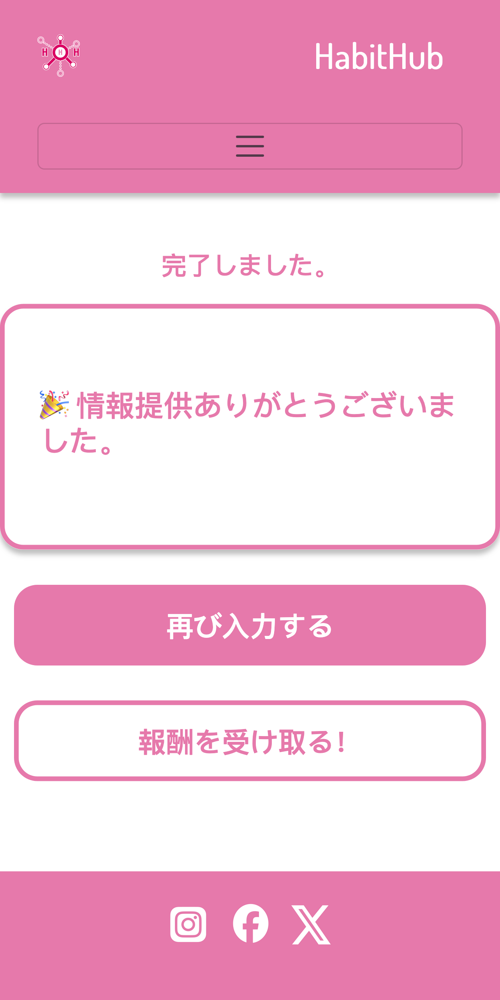

# ユーザーマニュアル

## はじめに

### アプリの目的

Habit Appにご興味をお持ちいただき、またご利用をご検討いただきありがとうございます！Habit Appは、多様な背景や文化を持つ個人の日常的な習慣を収集するために設計されています。習慣は通常、行動（例：歯磨き）と文脈（例：朝起きた後）を結びつけるものであり、多くの場合、無意識に実行され、最小限の認知的努力を必要とします。

調査への参加は、研究支援のためのデータ提供を伴うため、完全に任意かつ匿名である。収集されたデータは、行動やそれに関連する文脈といった習慣要素の包括的なデータベースを構築することを目的としている。このデータベースは、例えば、有益な習慣を確立するための最適なコンテクストを特定したり、習慣がより強固になるのを助けたり、習慣的行動における文化的差異を探求したりといった研究を促進する。習慣に効果的なコンテクストをよりよく理解することで、肯定的な習慣を定義し促進することが容易になり、最終的にその強化を支援することができます。

あなたのデータを提供することで、私たちの社会の習慣をよりよく理解し、有益な習慣を身につけるための影響力を支援することになります。

Habit Appは、日本、カナダ、ドイツの著名な研究機関による国際協力のもと、開発・提供・研究されています。

### ユーザーマニュアルの使い方

ユーザーマニュアルは、Habitアプリの使い方や理解を深めるのに役立ちます。そのために、Habitアプリの主な部分を紹介しています。Habitアプリの主なページに沿って説明しています。Habitアプリのスクリーンショット、またはHabitアプリの各エリアとそれに対応する説明は、アプリを理解するのに役立ちます。

## 最初のステップ

Habitアプリを使用するには、FirefoxやChromeなどの標準ブラウザと、WLANやモバイルデータ通信などのインターネット接続が必要です。タブレットやスマートフォンでHabitアプリを使用するのが最適です。インストールは必要ありません。

Habitアプリのアイデアが気に入り、長期にわたって研究プロジェクトをサポートしたい場合は、ホーム画面にブックマークを作成し、素早くアクセスできるようにしてください。

## 習慣を寄付する

### 背景情報

習慣とは何かという理解は、社会的・文化的環境によって異なる可能性があるため、習慣アプリでは、このような状況に適応した習慣の調査方法を開発・実装しました。この方法は、習慣という用語の定義の明確化と情報がデータ提供の質に影響を与えるという仮定に基づいている。この仮定によると、以下の要素が調査に影響を与える：

- **一般的な指示**： 一般的な指示：一般的な指示には、歓迎の言葉と習慣という用語の定義が含まれる。習慣の構成要素が説明され、習慣の少なくとも1つの具体例が示される。更なる研究へのデータ提供の貢献が説明される。

- **タスクの説明**： タスクの記述には、習慣化に入ってからデータ提供を提出するまでの一連のステップの正確な記述が含まれる。

これらの要素を指定したり組み合わせたりすることによって、習慣を収集するためのさまざまな可能性が生じる。これらの組み合わせは4つの実験グループに分けられ、習慣アプリによって実施される。実験グループの構成は以下の通りである：

**実験グループ1** - 習慣アプリの利用者は、一般的な指示とタスクの説明を表示することにより、包括的な指示を与えられる。習慣は事前に定義されたスキームに従って記録される。

**実験グループ2** - 習慣アプリの利用者は、タスクの説明を表示することによって部分的な指示を与えられる。習慣はそれ以上の指示なしに自分の言葉で記録される。

**実験グループ3** - 習慣アプリ利用者は、一般的な指示を表示することで部分的な指示を与えられる。習慣はあらかじめ定義されたスキームに従って記録される。

**実験グループ4** - 習慣アプリの利用者には何も指示を与えない。習慣は指示なしに自分の言葉で記録される。

### ステップバイステップ

#### ステップ1：Habitアプリを開く

Habitアプリはブラウザのリンクをクリックして開きます。スタート画面にアプリのブックマークがある場合は、そこからアプリを開くこともできます。

#### ステップ2：習慣を寄付する

習慣化アプリを開くと、バックグラウンドで4つの実験グループのいずれかが決定・選択されます（「習慣を寄付する」参照）。新しいブラウザセッションでHabitアプリを開くと、4つの実験グループのうちの1つがランダムに決定され、選択されます。しかし、既存のブラウザセッションですでに習慣が寄付されている場合は、この実験グループが採用されます。

実験グループの選択は、Habitアプリでどのようなコンテンツを見ることができるか、習慣を寄付するための説明がどの程度提供されるかに影響する。したがって、Habitアプリを開いたとき、スタートページの内容は実験グループによって決定される（スタートページの振る舞いセクション参照）。

**実験グループ1**

  

    
  

  

   ページはヘッダー、メイン、フッターのエリアに分かれています。ヘッダーエリアにはナビゲーションメニューと言語設定のオプションがあります。フッターエリアには、Habitアプリに関連するソーシャルメディアへのリンクが含まれています。
      
   ページのメインエリアは3つのサブエリアに分かれています - 一般的な説明のある上部エリア、タスクの説明と習慣を記録するオプションのある中央エリア、寄付を送るための下部エリアです。真ん中のエリアにある習慣を記録するオプションは、習慣を入力するエリアと、文脈と行動をマークするエリアに分かれている。習慣を入力した後、文脈や行動を表す個々の単語や関連する単語群を入力フィールドで選択することができる。そして、入力フィールドの下にあるそれぞれのボタンを押すことで、以前に選択した単語を文脈や行動としてマークすることができます。入力フィールドの右にある↺ボタンを押すと、選択した内容を完全にリセットできます。
      
    Habitアプリのユーザーがロボットではなく人間であるという確認（reCAPTCHA）は、セキュリティ上の予防措置です。
      
    入力フィールドで習慣を入力・選択したら、下部のボタンを押すことで習慣を寄付することができます。
  

**実験グループ2**

  

    
  

  

    ページはヘッダー、メイン、フッターのエリアに分かれています。ヘッダーエリアにはナビゲーションメニューと言語設定のオプションがあります。フッターにはHabitアプリに関連するソーシャルメディアへのリンクが含まれています。
      
    ページのメインエリアは2つのサブエリアに分かれています-タスクの説明と習慣を記録するオプションのある上部エリアと寄付を送るための下部エリアです。真ん中のエリアにある習慣を記録するオプションは、習慣を入力するエリアと、コンテキストと行動をマークするエリアに分かれている。習慣を入力した後、文脈や行動を表す個々の単語や関連する単語群を入力フィールドで選択することができる。そして、入力フィールドの下にあるそれぞれのボタンを押すことで、以前に選択した単語を文脈や行動としてマークすることができます。入力フィールドの右にある↺ボタンを押すと、選択した内容を完全にリセットできます。
      
    Habitアプリのユーザーがロボットではなく人間であるという確認（reCAPTCHA）は、セキュリティ上の予防措置です。
      
    入力フィールドで習慣を入力・選択したら、下部のボタンを押すことで習慣を寄付することができます。
  

**実験グループ3**

  

    
  

  

    ページはヘッダー、メイン、フッターのエリアに分かれています。ヘッダーエリアにはナビゲーションメニューと言語設定のオプションがあります。フッターエリアには、Habitアプリに関連するソーシャルメディアへのリンクが含まれています。
      
    ページのメインエリアは3つのサブエリアに分かれています - 一般的な説明のある上部エリア、タスクの説明と習慣を記録するオプションのある中央エリア、寄付を送るための下部エリアです。習慣は1つの文章として入力フィールドに入力されます。
      
    Habitアプリのユーザーがロボットではなく人間であることの確認（reCAPTCHA）は、セキュリティ上の予防措置である。
      
    入力フィールドに習慣が入力され、選択されると、下部にあるボタンを押すことで習慣を寄付することができます。
  

**実験グループ4**

  

    
  

  

    ページはヘッダー、メイン、フッターのエリアに分かれています。ヘッダーエリアにはナビゲーションメニューと言語設定のオプションがあります。フッターエリアには、Habitアプリに関連するソーシャルメディアへのリンクが含まれています。
      
    ページのメインエリアは2つのサブエリアに分かれています-タスクの説明と習慣を記録するオプションのある上部エリアと寄付を提出するための下部エリアです。習慣は1つの文章として入力フィールドに入力されます。
      
    Habitアプリのユーザーがロボットではなく人間であることの確認（reCAPTCHA）は、セキュリティ上の予防措置である。
      
    入力フィールドに習慣が入力され、選択されると、下部にあるボタンを押すことで習慣を寄付することができます。
  

##### ステップ3：さらなる任意情報

習慣が記録された後、習慣が最終的に寄付される前に、Habit Appユーザーはさらなる任意情報を提供する機会があります。

要求される任意情報には、Habit Appユーザーの以下の人口統計学的情報が含まれます：

- 性別
- 年齢
- 体重
- 宗教
- 交際ステータス
- 子供とペット
- 出身国
- 余暇活動
- 学歴
- 職業と日常生活

任意情報の追加収集により、提供された習慣をよりよく分類することができ、研究上の価値がさらに高まります。

複数の習慣を連続して、またはブラウザセッション内で提供する場合、追加の任意情報は何度も要求されず、最初のデータ提供時にのみ要求されます。

  

    
  

  

    ページはヘッダー、メイン、フッターのエリアに分かれています。ヘッダーエリアにはナビゲーションメニューと言語設定のオプションがあります。フッターには、Habitアプリに関連するソーシャルメディアへのリンクが含まれています。
      
    ページのメインエリアは2つのサブエリアに分かれており、上部エリアでは追加任意情報の簡単な説明があり、下部エリアでは任意情報を入力し、最後に寄付を送信します。
  

#### ステップ4：感謝

  

    
  

  

    ページはヘッダー、メイン、フッターエリアに分かれています。ヘッダーエリアにはナビゲーションメニューと言語設定のオプションがあります。フッターにはHabitアプリに関連するソーシャルメディアへのリンクが含まれています。
      
    ページのメインエリアは2つのサブエリアに分かれています-感謝の言葉が表示される上部エリアと、別の習慣を寄付したり報酬を集めたりできる下部エリアです。再び習慣を寄付することを選択すると、Habitアプリのトップページが呼び出されます。
  

#### ステップ5：報酬と視覚化

進行中（ここでは、寄付者が自分のデータ寄付とすべてのデータ寄付の全体とを関連付ける可視化を提示されることだけが示されている）。

## データ保護と情報セキュリティ

進行中

## ヘルプとサポート

進行中

## 用語集

### コンテキストの説明

#### 時間

ラベル タイムリファレンス

説明 時間は習慣形成に影響を与える最も顕著な文脈変数の一つである。それは一貫した予測可能なアンカーとして機能し、特定の行動を特定の瞬間や期間と関連付けやすくする。時間的な手がかりは習慣反復の自然なリズムを作り出し、意識的な意思決定への依存を減らす。

例 時刻が明示されている場合は「朝6時、仕事を始める前にジョギングをする」、時刻が明示されていない場合は「朝、軽くジョギングをする」。ここでは、時間帯がトリガーとして機能し、習慣が定期的に実行され、個人のスケジュールにシームレスに適合することを保証する。

### フィジカル・セッティング

ラベル 物理的設定

説明 物理的設定とは、習慣が行われる特定の場所のことである。環境は、習慣的行動を促す視覚的または感覚的な手がかりを提供するため、行動の強化において重要な役割を果たす。うまく設計された物理的環境は、障壁や注意散漫を最小限に抑えることによって習慣を強化することができる。

例 「キッチンでは、カウンターの上の水筒を見るたびにコップ一杯の水を飲む。キッチンと目に見える水筒は、行動の空間的・視覚的トリガーとして連動する。

### ソーシャル・コンテキスト

ラベル 人々

説明 社会的文脈には、習慣的行動の間に存在する人々や社会的環境が含まれる。他者との相互作用は、説明責任を促したり、協調性を育んだり、行動を模範化したりすることで、習慣に大きな影響を与えうる。社会的な合図は、その力関係によって習慣を肯定的にも否定的にも強化することができる。

例 「同僚がコーヒー休憩を取るときはいつも、私も一緒におしゃべりをする。他の人がいることが社会的な手がかりとなり、グループ活動に参加する習慣が強化される。

### 先行行動

ラベル 事前行動

説明 先行行動は、多くの習慣の連続性や連鎖性を強調する。多くの場合、1つの行動は自然に別の行動につながり、相互に関連した活動の流れを作り出す。この連鎖効果により、認知的な努力が軽減され、時間の経過とともにルーチンが強化される。

例 「歯を磨いた後、毎晩フロスをする」 歯磨きという行為が、フロスを使う前兆やきっかけとなり、ルーティンとしてその行動を継続しやすくなる。

### 内部状態

ラベル 内部状態

説明 内的状態とは、習慣的行動のきっかけとなる感情的または生理的状態を指す。ストレス、落ち着き、空腹、疲労などの感情は、個人が内的経験を調整したり、それに対応しようとするため、特定の行動を促すことがある。

例 「ストレスを感じたら、マインドフルネス瞑想を10分間行い、落ち着きと集中力を取り戻す。ストレスという感情状態が、心を落ち着かせ、回復させる習慣の手がかりとなる。

## 法的情報

進行中
