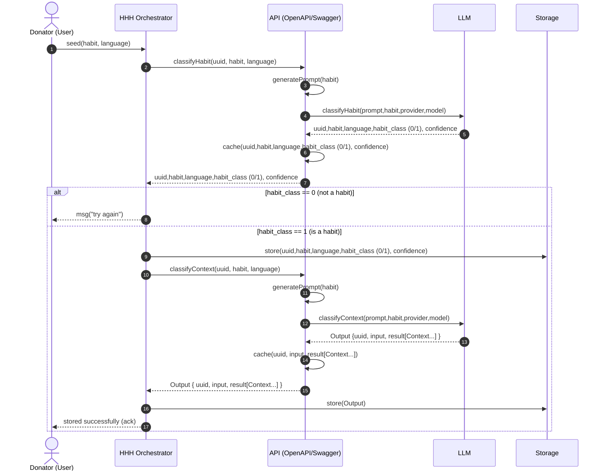

```mermaid
sequenceDiagram
    autonumber
    actor Donator as Donator (User)
    participant HHH as HHH Orchestrator
    participant API as API (OpenAPI/Swagger)
    participant LLM as LLM
    participant DB as Storage

    Donator->>HHH: seed(habit, language)
    HHH->>API: classifyHabit(uuid, habit, language)
    API->>API: generatePrompt(habit)
    API->>LLM: classifyHabit(prompt,habit,provider,model)
    LLM-->>API: uuid,habit,language,habit_class (0/1), confidence
    API->>API: cache(uuid,habit,language,habit_class (0/1), confidence)
    API-->>HHH: uuid,habit,language,habit_class (0/1), confidence

    alt habit_class == 0 (not a habit)
        HHH-->>Donator: msg("try again")
    else habit_class == 1 (is a habit)
        HHH->>DB: store(uuid,habit,language,habit_class (0/1), confidence)
        HHH->>API: classifyContext(uuid, habit, language)
        API->>API: generatePrompt(habit)
        API->>LLM: classifyContext(prompt,habit,provider,model)
        LLM-->>API: Output {uuid, input, result[Context...] }
        API->>API: cache(uuid, input, result[Context...])
        API-->>HHH: Output { uuid, input, result[Context...] }
        HHH->>DB: store(Output)
        HHH-->>Donator: stored successfully (ack)
    end
```